# ĐẶC TẢ ÁNH XẠ SCHEMA PHÁT HIỆN 6 LOẠI GIAN LẬN (F1 - F6)
## CHUYÊN BIỆT CHO MÔ HÌNH TAXI CƠ HỮU GREEN SM HÀ NỘI (100% XE CÔNG TY, TÀI XẾ HĐLĐ)
*(Căn cứ theo tài liệu nghiệp vụ [FRAUDS.md](file:///e:/THUCTAP/crawldata/GSM_SIMULATOR-check/FRAUDS.md), Quy tắc Ứng xử 11/09/2026, Quyết định Sàn GF-VIP 650k/ngày)*

---

## 1. TỔNG QUAN KIẾN TRÚC DỮ LIỆU ĐỐI SOÁT

Hệ thống phát hiện gian lận của Green SM sử dụng cơ chế **đối soát chéo 4 tầng độc lập** (không phụ thuộc vào lời khai đơn phương của tài xế trên app di động):

```mermaid
graph TD
    subgraph L0["TẦNG L0: MASTER DATA & CHÍNH SÁCH"]
        DP["driver_profile.parquet<br/>(track, vehicle_class, declared_shift_window)"]
        PB["policy_bundle.parquet<br/>(đơn giá cước, sàn 650k/ngày, bù 90k/cuốc)"]
    end

    subgraph L1R["TẦNG L1 & L1R: GIAO DỊCH & VẬN DOANH APP"]
        TR["trips.parquet<br/>(status, cancel_reason, arrived_at_pickup, gross_vnd)"]
        DS["driver_statistic_daily.parquet<br/>(tỷ lệ nhận, tỷ lệ hủy, fulfillment_rate)"]
        DI["driver_income_daily.parquet<br/>(tiền lương, thưởng KPI, tiền bù sàn 650k)"]
        DH["driver_online_hours_sap_id.parquet<br/>(giờ online/offline, depot_id quản lý)"]
    end

    subgraph TEL["TẦNG TELEMETRY: PHẦN CỨNG IOT VINFAST"]
        VTP["vehicle_telemetry_ping.parquet<br/>(odometer CAN-bus, speed, gear, seat_occupancy)"]
        TLE["trip_lifecycle_event.parquet<br/>(arrival_geofence_check_passed, no_show)"]
        CAM["camera_event.parquet<br/>(AI đếm khách, ghế sau trống, che camera)"]
    end

    subgraph MAP["TẦNG BẢN ĐỒ & ĐỊA LÝ HÀ NỘI"]
        OSRM["osrm_matrix_dd.parquet<br/>(cự ly đường bộ tối ưu road_km)"]
        GEO["hanoi_geom.json<br/>(ranh giới địa bàn hành chính 12 quận Hà Nội)"]
    end

    DP & PB & TR & VTP --> F1["F1: Chở khách không tạo cuốc"]
    TR & OSRM & VTP --> F2["F2: Kéo dài hành trình cuốc xe"]
    VTP & DP & DH --> F3["F3: Làm mất tín hiệu định vị TCU"]
    VTP & DP & GEO --> F4["F4: Dùng xe việc riêng ngoài ca"]
    TR & VTP & CAM & DI --> F5["F5: Tạo cuốc xe ảo trục lợi sàn 650k"]
    TR & VTP & TLE & DS --> F6["F6: Hủy sai lý do / Kén cuốc"]
```

---

## 2. MA TRẬN TỔNG HỢP ÁNH XẠ SCHEMA (MASTER MATRIX)

| Mã lỗi | Tên hành vi | Bảng chính (Trigger) | Trường điều kiện phát hiện | Bảng & Trường đối soát chéo | Trường tính tiền truy thu & Chế tài |
|:---:|---|---|---|---|---|
| **F1** | **Chở khách không tạo cuốc** *(Off-app pickup)* | [`trips`](file:///e:/THUCTAP/crawldata/GSM_SIMULATOR-check/schemas/l1r/trips.schema.json) | • `status == "cancelled"` • `arrived_at_pickup_time IS NOT NULL` • `cancelled_by in ["driver", "customer"]` | [`vehicle_telemetry_ping`](file:///e:/THUCTAP/crawldata/GSM_SIMULATOR-check/schemas/telemetry/vehicle_telemetry_ping.schema.json): • `trip_id IS NULL` • `speed_kmh >= 10.0` • `seat_occupancy.any_passenger_seat == true` [`camera_event`](file:///e:/THUCTAP/crawldata/GSM_SIMULATOR-check/schemas/telemetry/camera_event.schema.json): • `detected_passenger_count >= 1` | • `odometer_km` ($\Delta\text{ODO}$): số km chạy lậu. • [`driver_profile`](file:///e:/THUCTAP/crawldata/GSM_SIMULATOR-check/schemas/l0/driver_profile.schema.json): `vehicle_class` để áp giá (VF5: 13k/km, VF6/e34: 14.5k/km, VF8: 19k/km). • Phạt trừ ví 1 - 2 triệu, đình chỉ 7 - 14 ngày. |
| **F2** | **Kéo dài hành trình cuốc xe** *(Route deviation)* | [`trips`](file:///e:/THUCTAP/crawldata/GSM_SIMULATOR-check/schemas/l1r/trips.schema.json) | • `status == "completed"` • `distance_km`: km tính cước • `pickup_h3`, `drop_h3`: ô đón/trả | **Ma trận OSRM (`osrm_matrix`)**: • `cell_from`, `cell_to` • `road_km`: km tối ưu đường bộ • Tỷ lệ lệch: $\frac{\text{distance\_km} - \text{road\_km}}{\text{road\_km}} > \text{p99}$ [`vehicle_telemetry_ping`](file:///e:/THUCTAP/crawldata/GSM_SIMULATOR-check/schemas/telemetry/vehicle_telemetry_ping.schema.json): `lat`, `lng` vết chạy lệch hành lang | • `trips.gross_vnd`: hoàn trả tiền cước thu vượt cho khách hàng. • Phạt trừ ví ATA 500k - 1 triệu đồng. |
| **F3** | **Làm mất tín hiệu định vị** *(TCU/GPS tampering)* | [`vehicle_telemetry_ping`](file:///e:/THUCTAP/crawldata/GSM_SIMULATOR-check/schemas/telemetry/vehicle_telemetry_ping.schema.json) | • Khoảng trống 2 ping `gap_minutes > 15` • ODO xe tăng: $\Delta\text{odometer\_km} \ge 3.0\text{ km}$ | [`driver_profile`](file:///e:/THUCTAP/crawldata/GSM_SIMULATOR-check/schemas/l0/driver_profile.schema.json): • `declared_shift_window`: xác nhận mất sóng diễn ra TRONG CA trực. [`vehicle_telemetry_ping`](file:///e:/THUCTAP/crawldata/GSM_SIMULATOR-check/schemas/telemetry/vehicle_telemetry_ping.schema.json): • `phone_connectivity_lost == true` • `battery_level_pct` tụt mạnh khi app đứng yên | • $\Delta\text{odometer\_km} \times 13.000\text{ đ/km}$. • [`driver_online_hours_sap_id`](file:///e:/THUCTAP/crawldata/GSM_SIMULATOR-check/schemas/l1r/driver_online_hours_sap_id.schema.json): `depot_id` thu hồi xe về kiểm định kỹ thuật hộp TCU. |
| **F4** | **Sử dụng xe ngoài ca trực** *(Personal vehicle use)* | [`vehicle_telemetry_ping`](file:///e:/THUCTAP/crawldata/GSM_SIMULATOR-check/schemas/telemetry/vehicle_telemetry_ping.schema.json) | • `speed_kmh >= 10.0` • `odometer_km` tăng tích lũy $\ge 10\text{ km}$ khi ngoài ca trực | [`driver_profile`](file:///e:/THUCTAP/crawldata/GSM_SIMULATOR-check/schemas/l0/driver_profile.schema.json): • `declared_shift_window`: ca trực đăng ký. [`trip_lifecycle_event`](file:///e:/THUCTAP/crawldata/GSM_SIMULATOR-check/schemas/telemetry/trip_lifecycle_event.schema.json): • `event_type == "went_offline"` **`hanoi_geom`**: • `lat`, `lng` ra ngoài Hà Nội và chạy $\ge 3\text{ km}$ | • $\text{km\_off\_shift} \times 3.500\text{ đ/km}$ (chi phí điện, khấu hao pin, hao mòn lốp/gầm xe). • Xử lý kỷ luật lao động vi phạm quản lý tài sản công ty. |
| **F5** | **Tạo cuốc xe ảo** *(Fake / Ghost trips)* | [`trips`](file:///e:/THUCTAP/crawldata/GSM_SIMULATOR-check/schemas/l1r/trips.schema.json) + [`vehicle_telemetry_ping`](file:///e:/THUCTAP/crawldata/GSM_SIMULATOR-check/schemas/telemetry/vehicle_telemetry_ping.schema.json) | • `trips.status == "completed"` • `trips.distance_km >= 0.8` • `vtp.speed_kmh < 3.0` (đứng yên) • `vtp.odometer_km` biến thiên $< 0.3\text{ km}$ | [`vehicle_telemetry_ping`](file:///e:/THUCTAP/crawldata/GSM_SIMULATOR-check/schemas/telemetry/vehicle_telemetry_ping.schema.json): • `gear in ["P", "N"]` (không vào số D) • `seat_occupancy.any_passenger_seat == false` [`camera_event`](file:///e:/THUCTAP/crawldata/GSM_SIMULATOR-check/schemas/telemetry/camera_event.schema.json): • `detected_passenger_count == 0` | • Thu hồi 100% `trips.gross_vnd`. • [`driver_income_daily`](file:///e:/THUCTAP/crawldata/GSM_SIMULATOR-check/schemas/l1r/driver_income_daily.schema.json): Thu hồi tiền bù Sàn GF-VIP 650k/ngày (90k/cuốc thiếu). • Phạt Nhóm 1b: 5 - 10 triệu đồng, **SA THẢI VĨNH VIỄN, THU HỒI XE Ô TÔ VỀ DEPOT**. |
| **F6** | **Hủy sai lý do / Kén cuốc** *(Abnormal cancellation)* | [`trips`](file:///e:/THUCTAP/crawldata/GSM_SIMULATOR-check/schemas/l1r/trips.schema.json) | • `status == "cancelled"` • `cancelled_by == "driver"` • `cancel_reason == "khach_khong_den"` • `arrived_at_pickup_time IS NULL` | [`vehicle_telemetry_ping`](file:///e:/THUCTAP/crawldata/GSM_SIMULATOR-check/schemas/telemetry/vehicle_telemetry_ping.schema.json): • Khoảng cách xe tới `pickup_h3`/`pickup_lat, lng` luôn $> 150\text{ m}$ (chưa tới nơi). [`trip_lifecycle_event`](file:///e:/THUCTAP/crawldata/GSM_SIMULATOR-check/schemas/telemetry/trip_lifecycle_event.schema.json): • `arrival_geofence_check_passed == false/null` | • [`driver_penalization_ATA`](file:///e:/THUCTAP/crawldata/GSM_SIMULATOR-check/schemas/l1r/driver_penalization_ATA.schema.json): Phạt trừ ví 1 - 2 triệu đồng. • [`driver_statistic_daily`](file:///e:/THUCTAP/crawldata/GSM_SIMULATOR-check/schemas/l1r/driver_statistic_daily.schema.json): `fulfillment_rate < 0.90` (hoặc $< 0.95$ với GF-VIP) $\rightarrow$ **CẮT TOÀN BỘ SÀN THU NHẬP 650K/NGÀY**. |

---

## 3. CHI TIẾT CÁC TRƯỜNG DỮ LIỆU CHO TỪNG LOẠI GIAN LẬN

### F1: Chở Khách Không Tạo Cuốc (Off-App Pickup / Street Hail)
* **Module cài đặt:** [`src/lcx_core/telemetry_tier/off_app_pickup.py`](file:///e:/THUCTAP/crawldata/GSM_SIMULATOR-check/src/lcx_core/telemetry_tier/off_app_pickup.py)
* **Bản chất nghiệp vụ:** Tài xế tắt app hoặc xúi giục khách hủy chuyến sau khi đã đến điểm đón, tự ý chở khách thu tiền mặt riêng. Chiếm đoạt doanh thu và lạm dụng chi phí điện/pin do GSM chi trả.

#### Danh mục các trường Schema:
1. **`trips`** ([`schemas/l1r/trips.schema.json`](file:///e:/THUCTAP/crawldata/GSM_SIMULATOR-check/schemas/l1r/trips.schema.json)):
   - `trip_id` (string): Khóa chính cuốc xe.
   - `driver_id` (string): Mã định danh tài xế.
   - `status` (string): Phải là `"cancelled"`.
   - `cancelled_by` (string): `"driver"` hoặc `"customer"`.
   - `cancel_reason` (string): Lý do hủy chuyến.
   - `pickup_time` hoặc `arrived_at_pickup_time` (string ISO): Mốc thời gian tài xế đã tiếp cận điểm đón.
   - `pickup_h3`, `drop_h3` (string): Tọa độ đón/trả ban đầu.
2. **`vehicle_telemetry_ping`** ([`schemas/telemetry/vehicle_telemetry_ping.schema.json`](file:///e:/THUCTAP/crawldata/GSM_SIMULATOR-check/schemas/telemetry/vehicle_telemetry_ping.schema.json)):
   - `trip_id` (null): **Trường cốt lõi**. Trong lúc xe chạy chở khách, `trip_id` trên viễn thám bị bỏ trống (không có cuốc app).
   - `occurred_at` (string ISO date-time): Timestamp ping. Nằm trong cửa sổ $[t_{\text{arrived}}, t_{\text{arrived}} + 45\text{ phút}]$.
   - `speed_kmh` (number): Vận tốc xe $\ge 10.0\text{ km/h}$.
   - `seat_occupancy.any_passenger_seat` (boolean): `true` (cảm biến trọng lượng ghế phụ/ghế sau ghi nhận có người ngồi).
   - `odometer_km` (number): Đồng hồ ODO CAN-bus của xe VinFast. Tính số km lăn bánh ngoài luồng:
     $$\Delta\text{ODO} = \max(\text{odometer\_km}) - \min(\text{odometer\_km})$$
   - `lat`, `lng` (number): Tọa độ đầu và cuối của chuyến đi ngoài app.
3. **`camera_event`** ([`schemas/telemetry/camera_event.schema.json`](file:///e:/THUCTAP/crawldata/GSM_SIMULATOR-check/schemas/telemetry/camera_event.schema.json)):
   - `camera_event_type` (string): `"passenger_count_exceeds_seat_sensor"`.
   - `detected_passenger_count` (integer): Số lượng khách AI nhận diện được trong khoang xe $\ge 1$.
   - `confidence` (number): Độ tin cậy nhận diện.
4. **`driver_profile`** ([`schemas/l0/driver_profile.schema.json`](file:///e:/THUCTAP/crawldata/GSM_SIMULATOR-check/schemas/l0/driver_profile.schema.json)):
   - `vehicle_class` (string): Phân hạng xe (`A_COMPACT`, `B_SEDAN`, `C_SUV`, `D_LUXURY`) để áp giá cước truy thu:
     $$\text{Số tiền truy thu} = \Delta\text{ODO (km)} \times \text{Đơn giá định mức (13.000đ - 19.000đ/km)}$$

---

### F2: Kéo Dài Hành Trình Cuốc Xe (Route Deviation / Route Inflation)
* **Module cài đặt:** [`src/lcx_core/tier_a/route_deviation.py`](file:///e:/THUCTAP/crawldata/GSM_SIMULATOR-check/src/lcx_core/tier_a/route_deviation.py)
* **Bản chất nghiệp vụ:** Tài xế cố tình đi đường vòng xa để nâng cước tính theo km thực tế, làm tổn hại uy tín dịch vụ taxi 5 sao của GSM và gây hao mòn xe vô căn cứ.

#### Danh mục các trường Schema:
1. **`trips`** ([`schemas/l1r/trips.schema.json`](file:///e:/THUCTAP/crawldata/GSM_SIMULATOR-check/schemas/l1r/trips.schema.json)):
   - `trip_id` (string): Mã cuốc xe.
   - `driver_id` (string): Mã tài xế.
   - `status` (string): `"completed"`.
   - `distance_km` (number): Quãng đường thực tế dùng để tính tiền khách.
   - `pickup_h3`, `drop_h3` (string): Ô lục giác H3 Res 7/Res 9 đón và trả khách.
   - `travel_mode` hoặc `vehicle_class` (string): Phân loại phương tiện để tính ngưỡng percentile p99 theo từng nhóm xe.
   - `gross_vnd` (integer): Tổng tiền cước đã thu của khách.
2. **`osrm_matrix`** (Tài nguyên định tuyến đường bộ):
   - `cell_from`, `cell_to` (string): Khớp với `pickup_h3`, `drop_h3`.
   - `road_km` (number): Cự ly đường bộ ngắn nhất/tối ưu nhất theo mạng lưới giao thông Hà Nội.
   - **Chỉ số phát hiện:**
     $$\text{deviation\_pct} = \frac{\text{distance\_km} - \text{road\_km}}{\text{road\_km}} > \text{Threshold (Percentile P99)}$$
3. **`vehicle_telemetry_ping`** ([`schemas/telemetry/vehicle_telemetry_ping.schema.json`](file:///e:/THUCTAP/crawldata/GSM_SIMULATOR-check/schemas/telemetry/vehicle_telemetry_ping.schema.json)):
   - `lat`, `lng`, `speed_kmh`: Đối soát chuỗi tọa độ (waypoints) xem xe có đi lệch khỏi hành lang giao thông tiêu chuẩn hay không.
4. **Trường hoàn tiền & Chế tài:**
   $$\text{Tiền hoàn trả cho khách} = (\text{distance\_km} - \text{road\_km}) \times \text{Đơn giá cước/km}$$

---

### F3: Làm Mất Tín Hiệu Định Vị (GPS/TCU Tampering / Signal Loss)
* **Module cài đặt:** [`src/lcx_core/telemetry_tier/tcu_signal_loss.py`](file:///e:/THUCTAP/crawldata/GSM_SIMULATOR-check/src/lcx_core/telemetry_tier/tcu_signal_loss.py)
* **Bản chất nghiệp vụ:** Tài xế tắt định vị điện thoại, phá sóng GPS hoặc can thiệp nguồn hộp TCU VinFast để che giấu hành vi chạy ngoài luồng.

#### Danh mục các trường Schema:
1. **`vehicle_telemetry_ping`** ([`schemas/telemetry/vehicle_telemetry_ping.schema.json`](file:///e:/THUCTAP/crawldata/GSM_SIMULATOR-check/schemas/telemetry/vehicle_telemetry_ping.schema.json)):
   - `driver_id` (string): Mã tài xế.
   - `vin` (string): Số khung xe VinFast (17 ký tự ISO).
   - `occurred_at` (string ISO date-time): Timestamp của ping. Dùng để tính khoảng trống mất sóng:
     $$\text{gap\_minutes} = \text{occurred\_at} - \text{prev\_occurred\_at} > 15\text{ phút}$$
   - `odometer_km` (number): Công-tơ-mét CAN-bus phần cứng xe:
     $$\Delta\text{ODO} = \text{odometer\_km} - \text{prev\_odometer\_km} \ge 3.0\text{ km}$$
   - `phone_connectivity_lost` (boolean): `true` (chứng minh điện thoại tài xế tắt GPS nhưng modem TCU của xe vẫn gửi được tín hiệu về).
   - `battery_level_pct` (number): Pin xe tụt mạnh trong lúc app báo xe đứng yên.
2. **`driver_profile`** ([`schemas/l0/driver_profile.schema.json`](file:///e:/THUCTAP/crawldata/GSM_SIMULATOR-check/schemas/l0/driver_profile.schema.json)):
   - `declared_shift_window` (array[int]): Khung ca làm việc `[start_min, end_min]`. Xác thực mất sóng diễn ra TRONG CA trực (có dung sai 15 phút đầu ca và 30 phút cuối ca).
3. **`driver_online_hours_sap_id`** ([`schemas/l1r/driver_online_hours_sap_id.schema.json`](file:///e:/THUCTAP/crawldata/GSM_SIMULATOR-check/schemas/l1r/driver_online_hours_sap_id.schema.json)):
   - `depot_id` (string): Depot chỉ định (Gia Lâm, Nam Từ Liêm, Yên Nghĩa) để thu hồi xe kiểm tra kỹ thuật.
4. **Trường truy thu tài chính:**
   $$\text{Số tiền truy thu} = \Delta\text{ODO (km)} \times 13.000\text{ VNĐ/km}$$

---

### F4: Sử Dụng Xe Mục Đích Cá Nhân Ngoài Ca Trực (Personal Vehicle Use)
* **Module cài đặt:** [`src/lcx_core/telemetry_tier/personal_use.py`](file:///e:/THUCTAP/crawldata/GSM_SIMULATOR-check/src/lcx_core/telemetry_tier/personal_use.py)
* **Bản chất nghiệp vụ:** Hết ca trực cam kết, tài xế không giao trả xe về Depot mà tự ý lái xe về quê, chở gia đình hoặc việc riêng ngoài giờ quy định.

#### Danh mục các trường Schema:
1. **`vehicle_telemetry_ping`** ([`schemas/telemetry/vehicle_telemetry_ping.schema.json`](file:///e:/THUCTAP/crawldata/GSM_SIMULATOR-check/schemas/telemetry/vehicle_telemetry_ping.schema.json)):
   - `driver_id`, `vin` (string): Định danh tài xế và phương tiện.
   - `occurred_at` (string ISO): Timestamp ghi nhận xe chạy ngoài giờ ca trực.
   - `speed_kmh` (number): $\ge 10.0\text{ km/h}$.
   - `odometer_km` (number): Tích lũy chênh lệch ODO để tính số km lạm dụng tài sản:
     $$\text{km\_off\_shift} = \sum \Delta\text{odometer\_km} \ge 10.0\text{ km}$$
   - `lat`, `lng` (number): Tọa độ xe đối chiếu với ranh giới Hà Nội (`hanoi_geo`). Nếu xe ra ngoài Hà Nội và chạy $\ge 3\text{ km}$ thì lập tức kích hoạt cờ đỏ vi phạm.
2. **`driver_profile`** ([`schemas/l0/driver_profile.schema.json`](file:///e:/THUCTAP/crawldata/GSM_SIMULATOR-check/schemas/l0/driver_profile.schema.json)):
   - `declared_shift_window` (array[int]): Giờ bắt đầu và kết thúc ca cam kết.
3. **`trip_lifecycle_event`** ([`schemas/telemetry/trip_lifecycle_event.schema.json`](file:///e:/THUCTAP/crawldata/GSM_SIMULATOR-check/schemas/telemetry/trip_lifecycle_event.schema.json)):
   - `event_type`: `"went_offline"` (xác nhận tài xế đã bấm hết ca trên app nhưng xe vẫn lăn bánh).
4. **Trường truy thu tài chính:**
   $$\text{Chi phí bồi hoàn khấu hao} = \text{km\_off\_shift} \times 3.500\text{ VNĐ/km}$$
   *(Định mức 3.500đ/km gồm: 450đ tiền điện + 1.200đ khấu hao pin VinFast + 1.850đ hao mòn lốp, khung gầm)*.

---

### F5: Tạo Cuốc Xe Ảo (Fake Trips / Trục Lợi Sàn GF-VIP 650k/Ngày & Thưởng KPI)
* **Module cài đặt:** [`src/lcx_core/telemetry_tier/fake_trip.py`](file:///e:/THUCTAP/crawldata/GSM_SIMULATOR-check/src/lcx_core/telemetry_tier/fake_trip.py)
* **Bản chất nghiệp vụ:** Tài xế dùng tài khoản phụ hoặc cấu kết người quen đặt cuốc ma, nhận cuốc rồi bấm hoàn thành chớp nhoáng để cày đủ $\ge 6$ cuốc/ngày nhằm rút trọn 650.000đ tiền bù sàn và các mốc thưởng KPI.

#### Danh mục các trường Schema:
1. **`trips`** ([`schemas/l1r/trips.schema.json`](file:///e:/THUCTAP/crawldata/GSM_SIMULATOR-check/schemas/l1r/trips.schema.json)):
   - `trip_id`, `driver_id` (string): Mã chuyến và tài xế.
   - `status` (string): `"completed"`.
   - `pickup_time`, `complete_time` (string ISO): Cửa sổ thời gian thực hiện cuốc.
   - `duration_seconds` (integer): Thời gian chuyến đi cực ngắn (bất thường).
   - `distance_km` (number): Quãng đường tính cước trên app $\ge 0.8\text{ km}$.
   - `gross_vnd` (integer): Tiền cước ảo thu được.
2. **`vehicle_telemetry_ping`** ([`schemas/telemetry/vehicle_telemetry_ping.schema.json`](file:///e:/THUCTAP/crawldata/GSM_SIMULATOR-check/schemas/telemetry/vehicle_telemetry_ping.schema.json)):
   - `trip_id` (string): Trùng khớp với mã cuốc đang xét.
   - `speed_kmh` (number): Tốc độ tối đa trong suốt thời gian cuốc $< 3.0\text{ km/h}$ (xe đứng im trong bãi đỗ).
   - `odometer_km` (number): Biến thiên ODO không đáng kể:
     $$\max(\text{odometer\_km}) - \min(\text{odometer\_km}) < 0.3\text{ km}$$
   - `gear` (string): Cần số CAN-bus ở `"P"` (Parking) hoặc `"N"`, không hề vào `"D"` (Drive).
   - `seat_occupancy.any_passenger_seat` (boolean): `false` (ghế hành khách hoàn toàn trống).
3. **`camera_event`** ([`schemas/telemetry/camera_event.schema.json`](file:///e:/THUCTAP/crawldata/GSM_SIMULATOR-check/schemas/telemetry/camera_event.schema.json)):
   - `camera_event_type`: `"no_face_detected"` hoặc camera cabin AI xác nhận không có khách.
   - `detected_passenger_count`: $0$.
4. **`driver_income_daily`** ([`schemas/l1r/driver_income_daily.schema.json`](file:///e:/THUCTAP/crawldata/GSM_SIMULATOR-check/schemas/l1r/driver_income_daily.schema.json)):
   - `commission`, `total_order`: Căn cứ thu hồi toàn bộ tiền bù sàn 650.000đ/ngày (bù 90k/cuốc) và tiền thưởng KPI đã nhận.
5. **Chế tài xử phạt (Quy tắc Ứng xử 11/09/2026 - Nhóm 1b):**
   - Phạt trừ ví 5.000.000 – 10.000.000 VNĐ.
   - **CHẤM DỨT HỢP ĐỒNG LAO ĐỘNG VĨNH VIỄN, THU HỒI XE Ô TÔ VỀ DEPOT**.

---

### F6: Hủy Sai Lý Do / Kén Chọn Cuốc Xe (Abnormal Cancellation / Cherry-Picking)
* **Module cài đặt:** [`src/lcx_core/telemetry_tier/invalid_driver_cancel.py`](file:///e:/THUCTAP/crawldata/GSM_SIMULATOR-check/src/lcx_core/telemetry_tier/invalid_driver_cancel.py)
* **Bản chất nghiệp vụ:** Tài xế nhận cuốc nhưng ngại ngõ nhỏ phố cổ hoặc đường tắc giờ tan tầm, liền bấm hủy với lý do đổ lỗi cho khách "Khách không đến" (`rider_no_show`) trong khi xe chưa từng tới điểm đón.

#### Danh mục các trường Schema:
1. **`trips`** ([`schemas/l1r/trips.schema.json`](file:///e:/THUCTAP/crawldata/GSM_SIMULATOR-check/schemas/l1r/trips.schema.json)):
   - `trip_id`, `driver_id` (string): Khóa chuyến và tài xế.
   - `status` (string): `"cancelled"`.
   - `cancelled_by` (string): `"driver"` (tài xế chủ động bấm hủy).
   - `cancel_reason` (string): `"khach_khong_den"` hoặc `"rider_no_show"`.
   - `arrived_at_pickup_time` (null): **Trường then chốt**. Bị rỗng (chưa từng bấm "Đã tới điểm đón").
   - `pickup_h3` hoặc `pickup_lat`, `pickup_lng` (number): Tọa độ điểm đón khách.
2. **`vehicle_telemetry_ping`** ([`schemas/telemetry/vehicle_telemetry_ping.schema.json`](file:///e:/THUCTAP/crawldata/GSM_SIMULATOR-check/schemas/telemetry/vehicle_telemetry_ping.schema.json)):
   - `lat`, `lng` (number): Vị trí thực tế của xe trong suốt thời gian mở cuốc.
   - Tính khoảng cách Haversine giữa vị trí xe và điểm đón: Nếu luôn $> 150\text{ m}$ $\rightarrow$ Chứng minh tài xế khai gian dối lý do hủy.
3. **`trip_lifecycle_event`** ([`schemas/telemetry/trip_lifecycle_event.schema.json`](file:///e:/THUCTAP/crawldata/GSM_SIMULATOR-check/schemas/telemetry/trip_lifecycle_event.schema.json)):
   - `event_type`: `"no_show_reported"` hoặc `"trip_cancelled"`.
   - `arrival_geofence_check_passed` (boolean): `false` hoặc `null` (không qua được bước kiểm tra bán kính geofence điểm đón).
4. **`driver_statistic_daily`** ([`schemas/l1r/driver_statistic_daily.schema.json`](file:///e:/THUCTAP/crawldata/GSM_SIMULATOR-check/schemas/l1r/driver_statistic_daily.schema.json)):
   - `cancelled_count` (integer): Số cuốc hủy trong ngày/tuần (nếu hủy $\ge 2$ cuốc/tuần $\rightarrow$ kích hoạt cờ F6).
   - `fulfillment_rate` (number): Tỷ lệ hoàn thành chuyến. Nếu tỷ lệ hoàn thành tụt xuống $< 90\%$ (hoặc $< 95\%$ với GF-VIP) $\rightarrow$ **CẮT TOÀN BỘ SÀN ĐẢM BẢO 650.000 VNĐ/NGÀY**.
5. **`driver_penalization_ATA`** ([`schemas/l1r/driver_penalization_ATA.schema.json`](file:///e:/THUCTAP/crawldata/GSM_SIMULATOR-check/schemas/l1r/driver_penalization_ATA.schema.json)):
   - Phạt hành chính: 1.000.000 VNĐ (hủy 1 - 5 cuốc/tuần) hoặc 2.000.000 VNĐ (hủy $> 5$ cuốc/tuần).

---

## 4. BẢNG TỔNG HỢP NGUỒN CHÂN LÝ THEO TẦNG SCHEMA

| Tầng dữ liệu | Thư mục Schema | Mục đích sử dụng trong Fraud Engine |
|---|---|---|
| **L0 Master Data** | [`schemas/l0/`](file:///e:/THUCTAP/crawldata/GSM_SIMULATOR-check/schemas/l0/) | Lấy thông tin phương tiện (`track`, `vehicle_class`, `vehicle_model`), ca trực đăng ký (`declared_shift_window`), và chính sách sàn (`policy_bundle`). |
| **L1/L1R Vận doanh** | [`schemas/l1r/`](file:///e:/THUCTAP/crawldata/GSM_SIMULATOR-check/schemas/l1r/) | Giám sát trạng thái cuốc xe (`trips`), tỷ lệ nhận/hủy (`driver_statistic_daily`), thu nhập và tiền bù sàn (`driver_income_daily`), và chế tài trừ ví (`driver_penalization_ATA`). |
| **Telemetry IoT** | [`schemas/telemetry/`](file:///e:/THUCTAP/crawldata/GSM_SIMULATOR-check/schemas/telemetry/) | Bằng chứng phần cứng bất biến: công-tơ-mét CAN-bus `odometer_km`, tốc độ `speed_kmh`, cần số `gear`, cảm biến ghế `seat_occupancy`, AI camera `camera_event`, và geofence điểm đón `trip_lifecycle_event`. |
| **Bản đồ OSRM** | `research/simulation/data/` | Đoạn đường ngắn nhất `road_km` để tính cước vượt và phát hiện xe đi lệch hành lang kết nối. |
