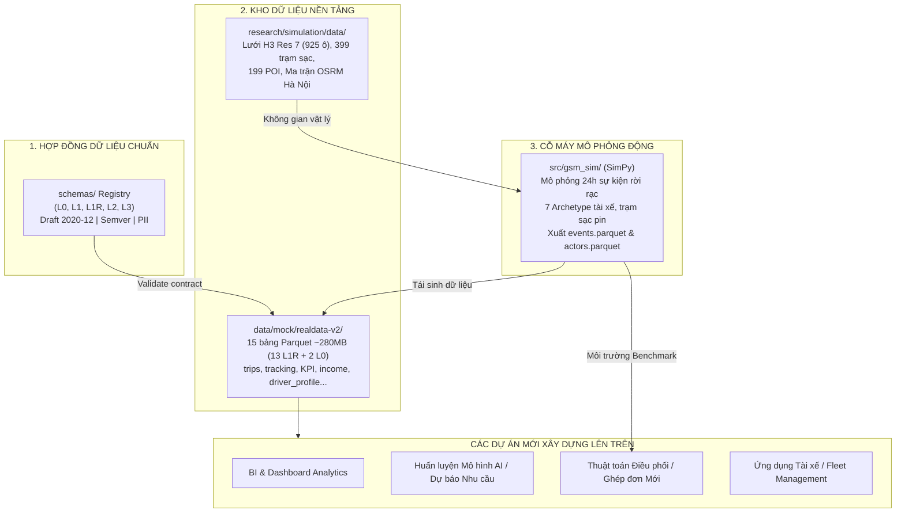
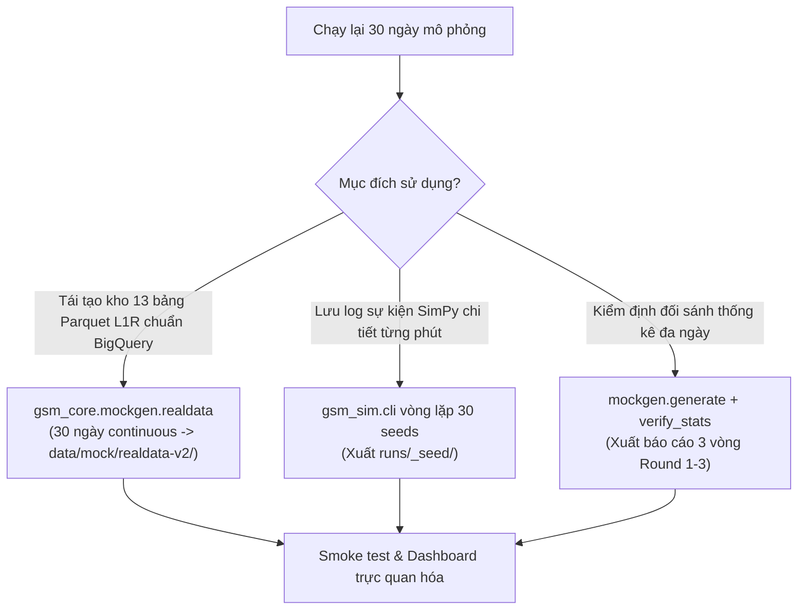

<div align="center">

# GSM_SIMULATOR
### Nền Tảng Dữ Liệu & Simulator Mô Phỏng Môi Trường (Digital Twin & Synthetic Data Provider)

[](https://www.python.org/)
[](https://simpy.readthedocs.io/)
[](https://h3geo.org/)
[](https://pola.rs/)
[](https://json-schema.org/)
[](#-kho-dữ-liệu-nền-tảng)

**Kho lưu trữ độc lập cung cấp Nền tảng Dữ liệu Chuẩn hóa (Data Schemas L0–L3, 15 bảng Parquet: 13 bảng L1R + 2 bảng tham chiếu L0, dữ liệu địa lý Hex H3/OSRM) và Cỗ máy Mô phỏng Môi trường (SimPy Discrete-Event Engine) để các dự án khác xây dựng giải pháp lên trên đó.**

</div>

---

> [!IMPORTANT]
> **Ranh giới bàn giao:**
> Kho mã nguồn này được tách riêng nhằm **cung cấp dữ liệu nền tảng và môi trường mô phỏng**. Kho mã nguồn **HOÀN TOÀN KHÔNG CHỨA SOLVER HAY CÁC BỘ GIẢI THUẬT TOÁN** (`gsm_core/solvers/*`). Simulator vận hành ở chế độ **Môi trường tự nhiên (Natural Baseline)** để sinh dữ liệu khách quan phục vụ Data Science, huấn luyện mô hình AI/ML, phân tích kinh doanh, hoặc làm môi trường benchmark cho các thuật toán điều phối riêng của các nhóm phát triển.

---

## 📑 Mục lục
- [1. Kiến trúc & Ba Trụ cột](#1-kiến-trúc--ba-trụ-cột)
- [2. Kho Dữ liệu Nền tảng Sẵn có](#2-kho-dữ-liệu-nền-tảng-sẵn-có)
- [3. Hệ thống Data Schemas (`schemas/`)](#3-hệ-thống-data-schemas-schemas)
- [4. Simulator Mô phỏng Môi trường (`gsm_sim`)](#4-simulator-mô-phỏng-môi-trường-gsm_sim)
- [5. Bắt đầu Nhanh (Quickstart)](#5-bắt-đầu-nhanh-quickstart)
- [6. Hướng dẫn Chạy lại Toàn bộ 30 Ngày Mô phỏng từ Đầu](#6-hướng-dẫn-chạy-lại-toàn-bộ-30-ngày-mô-phỏng-từ-đầu)
- [7. Kiểm thử & Đảm bảo Chất lượng](#7-kiểm-thử--đảm-bảo-chất-lượng)
- [8. Tài liệu Kỹ thuật Chi tiết](#8-tài-liệu-kỹ-thuật-chi-tiết)
- [9. Module GSM_FRAUD_DETECTION](#9-module-gsm_fraud_detection-sáp-nhập-2026-09-21)

---

## 1. Kiến trúc & Ba Trụ cột



---

## 2. Kho Dữ liệu Nền tảng Sẵn có

Sinh ra tại thư mục `data/mock/realdata-v2/` (lệnh ở mục 6.1) gồm **13 bảng L1R + 2 bảng L0 dạng Parquet** bám sát shape dữ liệu BigQuery/Data Warehouse thực tế của GSM.

> **Số liệu bộ hiện tại** (100% ô tô Taxi Cơ Hữu, 30 ngày, seed 7000): 1.000 tài xế · `trips` 75.349 dòng (3.681 hủy = 4,89%) · `public_driver_hex_tracking` 4.075.987 dòng (~280MB) · các bảng thống kê/thu nhập theo ngày 23.510 dòng · `driver_profile` 1.000 dòng.
> Số dòng và kích thước trong bảng bên dưới là của bộ cũ (bản gốc, lẫn xe máy) — chỉ dùng để tham khảo cấu trúc.


| Bảng Parquet | Kích thước | Mô tả & Usecase cho dự án mới |
|---|---|---|
| `trips.parquet` | ~7.7 MB | 174,233 dòng chi tiết chuyến đi (tọa độ H3 đón/trả, quãng đường, giá cước, thời gian di chuyển). |
| `public_driver_hex_tracking.parquet` | ~46.0 MB | Vết di chuyển của đội xe theo các ô H3 Hexagon qua từng phút. Dùng dựng Heatmap cung cầu. |
| `driver_statistic_daily.parquet` | ~0.13 MB | Snapshot KPI ngày của tài xế (tỷ lệ nhận, hoàn thành, hủy, đánh giá sao). |
| `driver_income_daily.parquet` | ~0.18 MB | Báo cáo tài chính ngày (cước thu được, hoa hồng, thu nhập thực nhận). |
| `driver_orders_rush_hours.parquet` | ~0.36 MB | Phân bổ số cuốc và doanh thu giữa Giờ cao điểm và Giờ thường. |
| `driver_online_hours_sap_id.parquet` | ~0.04 MB | Giờ online thực tế, trạm đỗ (depot), loại hợp đồng tài xế. |
| `driver_bike_stoppoints.parquet` | ~0.02 MB | Điểm dừng đỗ, thói quen chờ khách của tài xế xe máy. |
| `kpi_driver_platform_calculator_gbq.parquet` | ~0.01 MB | Bảng tính thưởng khoán tuần/tháng, theo dõi tiến độ đạt mốc thưởng. |
| `public_mission.parquet` | ~0.01 MB | Danh mục nhiệm vụ thưởng theo khung giờ. |
| `public_mission_earn_history.parquet` | ~0.18 MB | Lịch sử nhận thưởng nhiệm vụ của tài xế. |
| `public_user_mission_progress.parquet` | ~0.01 MB | Tiến độ thực hiện nhiệm vụ thời gian thực của tài xế. |
| `driver_penalization_ATA.parquet` | ~0.01 MB | Lịch sử phạt hành vi / trừ tiền vi phạm quy chế. |
| `public_frauds.parquet` | ~0.01 MB | Cảnh báo gian lận hoặc bất thường di chuyển. |

> 📖 **Tra cứu chi tiết từng cột**: Xem [`docs/data-catalog/gsm-data-catalog.csv`](docs/data-catalog/gsm-data-catalog.csv).

---

## 3. Hệ thống Data Schemas (`schemas/`)

Kho hợp đồng dữ liệu chuẩn hóa gồm **42 schema** phân chia theo 6 tầng kiến trúc:
- **`l0/` (Reference)**: Dữ liệu danh mục/chính sách ít biến động (`driver_profile`, `station`, `zone`...).
- **`l1/` (Event Log)**: Nhật ký sự kiện bất biến thực tế (`trip_record`, `gps_ping`, `battery_swap`...). Cấm trường ẩn.
- **`l1r/` (Real GSM)**: Schema chuẩn của 13 bảng GSM thực tế.
- **`l2/` & `l2i/` (State & Inferred)**: Trạng thái dẫn xuất (cung cầu, trạng thái ngày tài xế) và suy luận.
- **`l3/` (Feature Views)**: Dữ liệu đặc trưng phục vụ huấn luyện mô hình Machine Learning.

---

## 4. Simulator Mô phỏng Môi trường (`gsm_sim`)

Cỗ máy mô phỏng thế giới ảo (SimPy) 24 giờ (05:00 – 24:00) chuyên biệt cho **1000 xe Taxi Cơ Hữu VinFast Hà Nội**:
- **100% Mô hình Taxi Cơ Hữu (`track: "core_owned"`)**: Toàn bộ 1000 xe thuộc sở hữu công ty, tài xế ký HĐLĐ, giao nhận ca tại các Depot Hà Nội (Gia Lâm, Nam Từ Liêm, Yên Nghĩa), hưởng lương cơ bản + thưởng doanh số + sàn đảm bảo 650k/ngày (hoặc 18tr/tháng) và bù 90k/cuốc thiếu.
- **Phân bổ dòng xe VinFast**: VF5, VF6, VF e34, VF8 phân theo các hạng A_COMPACT, B_SEDAN, C_SUV, D_LUXURY.
- **Phân hóa hành vi 7 ca trực Archetype (`archetypes.py`)**: P1 (Ca ngắn), P2 (Full-time chuẩn 2 đỉnh), P3 (Top performer), P4 (Tân binh thử việc), P5 (Ca chiều tối), P6 (Ca sáng sớm 5h), P7 (Ca tối-đêm/sân bay).
- **Mô hình trạm sạc nhanh V-Green & sạc Depot**: Mô phỏng dung lượng pin xe điện (kWh), công suất sạc DC, thời gian sạc tại trạm, nguy cơ cạn pin giữa đường.
- **Dữ liệu đầu ra được lưu tự động trong `runs/<timestamp>_seed<N>/`**:
  * `events.parquet`: Log chi tiết mọi sự kiện từng phút (`order_matched`, `pickup`, `dropoff`, `charge`...).
  * `actors.parquet`: Tổng hợp hiệu suất 1000 tài xế cuối ngày (số cuốc, doanh thu, thời gian rỗng, pin).
  * `manifest.json`: Metadata phiên chạy và các chỉ số toàn hệ thống (served rate, ETA).

---

## 5. Bắt đầu Nhanh (Quickstart)

### 5.1. Cài đặt môi trường
Chỉ yêu cầu Python >= 3.11 và các thư viện tính toán cơ bản:

```bash
# Thư viện tính toán & mô phỏng cốt lõi:
pip install simpy h3 polars pyarrow shapely pyyaml scipy jsonschema

# Thư viện cho module phát hiện gian lận (lcx_core) và bộ test:
pip install pytest httpx fastapi "uvicorn[standard]" scikit-learn

# (Tùy chọn) Thư viện trực quan hóa nếu muốn mở giao diện Dashboard:
pip install streamlit plotly pydeck
```

### 5.2. Chạy Smoke Test kiểm tra toàn diện (< 30s)
Chạy script kiểm tra tự động 5 bước:

```bash
python scripts/smoke_test_data_foundation.py
```

### 5.3. Sinh 1 tập dữ liệu mô phỏng mới
```bash
python -m gsm_sim.cli run --config configs/pilot_hanoi.yaml --seed 100
```
### 5.4. Khởi chạy Giao diện Trực quan hóa (Dashboard)
```bash
streamlit run src/gsm_sim/dashboard.py
```
Giao diện sẽ mở trên trình duyệt tại `http://localhost:8501`, cho phép xem bản đồ nhiệt cung cầu, vị trí trạm sạc VinFast, và timeline di chuyển của từng tài xế.

### 5.5. Đọc dữ liệu bằng Python Polars
```python
import polars as pl
from pathlib import Path

# Đọc bảng cuốc xe thực tế
trips = pl.read_parquet("data/mock/realdata-v2/trips.parquet")
print(f"Tổng số cuốc: {len(trips):,}")

# Đọc kết quả mô phỏng mới nhất
latest_run = sorted(Path("runs").glob("*_seed*"))[-1]
events = pl.read_parquet(latest_run / "events.parquet")
actors = pl.read_parquet(latest_run / "actors.parquet")
print(f"Sự kiện: {len(events):,} | Tài xế: {len(actors)}")
```

---

## 6. Hướng dẫn Chạy lại Toàn bộ 30 Ngày Mô phỏng từ Đầu

Khi muốn tái sinh hoàn toàn dữ liệu sau khi cập nhật thông số biểu giá taxi ô tô điện, nâng cấp trạm sạc nhanh V-Green DC, hoặc cần 1 tháng dữ liệu vận doanh chuẩn đối soát (30 ngày liên tục = 4 chu kỳ tuần hoàn chỉnh), sử dụng trực tiếp các lệnh có sẵn của hệ thống:



### 6.1. Lệnh Chính: Tái sinh Kho 15 Bảng Parquet (13 L1R + 2 L0) (`gsm_core.mockgen.realdata`)

Đây là lệnh tiêu chuẩn của repo để sinh ra toàn bộ dữ liệu 1 tháng thực tế:

```bash
python -m gsm_core.mockgen.realdata \
  --days 30 \
  --seed-base 7000 \
  --out data/mock/realdata-v2 \
  --start-date 2026-07-01 \
  --continuous
```

**Giải thích các tham số:**
- `--days 30`: Số ngày mô phỏng (chu kỳ 30 ngày = 1 tháng vận doanh = 4 chu kỳ tuần).
- `--seed-base 7000`: Hạt giống ngẫu nhiên cơ sở. Đảm bảo tính tất định (deterministic) — cùng seed sẽ sinh dữ liệu y hệt nhau.
- `--out data/mock/realdata-v2`: Thư mục lưu 13 bảng Parquet L1R + 2 bảng tham chiếu L0 (`driver_profile`, `policy_bundle`). Chạy 30 ngày mất khoảng 15 phút. Thư mục này ~280MB nên **không đưa lên git** (đã có trong `.gitignore`). Muốn các test và module `lcx_core` đọc bản mới, đặt `realdata_dir` trong `configs/data_sources.yaml` trỏ tới thư mục này.
- `--start-date 2026-07-01`: Ngày bắt đầu mô phỏng theo định dạng YYYY-MM-DD.
- `--continuous`: Kích hoạt chuỗi ngày liên tục mang theo trạng thái tài xế (mức pin cuối ngày hôm trước nối sang ngày hôm sau, tích lũy tiến độ khoán tuần và chu kỳ thưởng nhiệm vụ).

**13 bảng L1R được tạo mới đồng bộ:**
1. `trips.parquet`: Chi tiết toàn bộ cuốc xe taxi điện 4 bánh (A, B, C, D), gồm cả cuốc **hủy sau khi nhận** (`status=cancelled`, có `cancel_reason`/`cancelled_by` — schema 1.1.0; lý do hủy là giả định MOCK).
2. `public_driver_hex_tracking.parquet`: Vết di chuyển của đội xe trên 925 ô lục giác H3 Res 7 toàn Hà Nội.
3. `driver_statistic_daily.parquet`: Thống kê KPI ngày (nhận, hủy, hoàn thành, đánh giá sao).
4. `driver_income_daily.parquet`: Báo cáo tài chính doanh thu gộp, chiết khấu và thu nhập thực nhận.
5. `driver_orders_rush_hours.parquet`: Phân bổ cuốc xe trong giờ cao điểm và giờ thường.
6. `driver_online_hours_sap_id.parquet`: Thời gian online thực tế, trạm sạc depot.
7. `driver_bike_stoppoints.parquet`: Điểm dừng đỗ, chờ khách của đội xe.
8. `kpi_driver_platform_calculator_gbq.parquet`: Tiến độ đạt mốc thưởng khoán tuần/tháng.
9. `public_mission.parquet`: Danh mục nhiệm vụ thưởng theo khung giờ.
10. `public_mission_earn_history.parquet`: Lịch sử nhận thưởng nhiệm vụ của tài xế.
11. `public_user_mission_progress.parquet`: Tiến độ nhiệm vụ thời gian thực.
12. `driver_penalization_ATA.parquet`: Lịch sử phạt hành vi / vi phạm quy chế.
13. `public_frauds.parquet`: Cảnh báo và phát hiện hành vi bất thường.

**2 bảng tham chiếu L0 đi kèm (cùng thư mục):**
- `driver_profile.parquet`: 1000 tài xế `core_owned`, dòng xe (VF5/VF6/VF e34/VF8), hạng xe, ca cam kết `declared_shift_window` (phút trong ngày). Khớp `vehicle_model` với bảng KPI.
- `policy_bundle.parquet`: 1 dòng chính sách gồm biểu giá theo hạng xe (`car_classes`). Lưu ý: `fare` cấp cao nhất (13.000đ + 4.300đ/km) chỉ là giá dự phòng, sim tính cước theo `car_classes`.

**Bảng vận hành ô tô cho F1/F3/F4/F5/F6** (ODO, tốc độ, ghế sau, cuốc huỷ có lý do, ca cam kết, kèm nhãn `ground_truth`) sinh riêng bằng `lcx_core.event_sim`:
```powershell
$env:PYTHONPATH="src"
.\.venv\Scripts\python.exe scripts\run_telemetry_tier_eval.py --n-days 30 --save-tables data/derived/event_sim
```

---

### Lưu ý về độ tin cậy và các hạn chế đã biết của bộ dữ liệu

Toàn bộ dữ liệu là **giả lập** (`source = MOCK`): cấu trúc bảng bám kho GSM, bản đồ là Hà Nội thật, nhưng hành vi và các con số **chưa hiệu chỉnh theo dữ liệu vận hành thật**.

- **Lý do hủy cuốc là giả định:** engine chỉ biết "hủy sau khi nhận"; `cancel_reason`/`cancelled_by` được gán theo tỷ lệ cố định (55% khách đổi ý, 20% sự cố xe, 25% "khách không đến").
- **`distance_km` là đường chim bay** (lệch khoảng -32% so với đường bộ OSRM) — theo hợp đồng thiết kế của engine.
- **Phân bố không gian chưa thật:** đơn hàng trải khá đều trên 925 ô toàn lưới (dân số chia đều), tài xế xuất phát ngẫu nhiên trên toàn lưới chứ chưa gắn Depot.
- **Mật độ cuốc thấp:** trung bình ~3 cuốc/tài xế/ngày (cấu hình 4.500 đơn/ngày cho 1.000 xe), thấp hơn mức 6 cuốc/ngày trong tài liệu FRAUDS.md.
- **Nhãn kho còn sót:** `hub_id = hub-dongda`, `depot_name = Dong Da` gán cho mọi tài xế; số khung `VIN...` và biển `29-MOCK...` là giả.
- **Hồ sơ xe:** 76% xe thuộc nhóm `swap` (đổi pin) — di sản từ thời xe máy, chưa phù hợp ô tô.
- **Bảng vận hành F1–F6 (`event_sim`) độc lập với bộ trên:** chỉ 120 xe (`sim-d-*`), chưa dùng chung mã tài xế với `driver_profile`; ngày giả từ năm 2099; các thông số (tốc độ, ngưỡng mức Nhẹ/Vừa/Nặng) là giả định. **Cập nhật 2026-09-28:** vị trí xe, trạm sạc (399 trạm thật từ `batt_hanoi.json`) và biên giới Hà Nội (F4 `personal_use`) nay lấy từ đúng lưới H3 Res 7 toàn Hà Nội đã dùng cho bộ `realdata-v2` (`lcx_core/event_sim/hanoi_geo.py`), thay cho 1 tâm điểm giả định + 3 trạm sạc giả trước đây; rơi về hành vi cũ nếu thiếu `research/simulation/data/`.
- `public_frauds` chỉ có loại `abnormal_cancel` (cờ p99 của engine) — các kịch bản F1–F6 nằm ở `ground_truth` của `event_sim`.

---

### 6.2. Chạy Vòng Lặp SimPy CLI Theo Từng Ngày (`gsm_sim.cli`)

Dành cho nhu cầu debug chuyên sâu từng ngày hoặc benchmark hiệu năng thuật toán điều phối trên từng seed cụ thể:

* **Trên Windows PowerShell:**
```powershell
1..30 | ForEach-Object {
    $seed = 100 + $_ - 1
    Write-Host ">>> [Ngày $_/30] Đang chạy SimPy Seed $seed..." -ForegroundColor Cyan
    python -m gsm_sim.cli run --config configs/pilot_hanoi.yaml --seed $seed
}
```

* **Trên Linux / macOS (Bash):**
```bash
for day in $(seq 1 30); do
    seed=$((100 + day - 1))
    echo ">>> [Ngày $day/30] Đang chạy SimPy Seed $seed..."
    python -m gsm_sim.cli run --config configs/pilot_hanoi.yaml --seed $seed
done
```

---

### 6.3. Sinh Dữ Liệu L1 & Kiểm Định Thống Kê 3 Vòng (Statistical Realism)

Để kiểm chứng dữ liệu 30 ngày có đạt chuẩn phân bố thực tế (Statistical Realism theo benchmark bài báo & dữ liệu khảo sát thực tế):

```bash
# Bước 1: Sinh bộ dữ liệu sự kiện L1 cho 30 ngày (tương đương 30 seeds độc lập)
python -m gsm_core.mockgen.generate --days 30 --seed-base 100 --out data/mock/v1 --start-date 2026-07-01

# Bước 2: Chạy kiểm định thống kê chuẩn hiện thực (Vòng 2 Statistical Realism)
python -m gsm_core.mockgen.verify_stats
```

Hệ thống sẽ tự động xuất 3 báo cáo đánh giá nghiêm ngặt vào `research/experiments/mockgen/`:
- `ROUND-1-schema-report.md`: Kiểm tra hợp đồng Schema và khóa ngoại FK liên bảng.
- `ROUND-2-realism-report.md`: Đối sánh số cuốc/ngày, thu nhập tài xế Full-time, cự ly chuyến đi với benchmark GSM thực tế.
- `ROUND-3-consistency-report.md`: Kiểm tra tính nhất quán chéo giữa sự kiện GPS, sổ cái Payout và cuốc xe.

---

### 6.4. Các Bước Hậu Kiểm Dữ Liệu (Post-run Verification)

Sau khi hoàn tất chạy 30 ngày mô phỏng, hãy thực hiện kiểm tra nhanh:

1. **Chạy Smoke Test toàn diện (< 30s):**
   ```bash
   python scripts/smoke_test_data_foundation.py
   ```
2. **Kiểm tra số dòng và cấu trúc cột của các bảng Parquet:**
   ```bash
   python scripts/check_parquet_columns.py
   ```
3. **Mở Giao diện Trực quan hóa (Dashboard) khám phá dữ liệu:**
   ```bash
   streamlit run src/gsm_sim/dashboard.py
   ```

---

## 7. Kiểm thử & Đảm bảo Chất lượng

Chạy bộ unit test cốt lõi:
```bash
pytest tests/test_schemas.py tests/test_geo.py tests/test_actors.py tests/test_sim_metrics.py -v
```

---

## 8. Tài liệu Kỹ thuật Chi tiết

Để tìm hiểu sâu hơn về cấu trúc chi tiết, sơ đồ tuần tự và cách mở rộng sang các địa bàn/loại xe mới, vui lòng tham khảo:
👉 **[`docs/handoff/DATA_FOUNDATION_AND_SIMULATOR_HANDOFF.md`](docs/handoff/DATA_FOUNDATION_AND_SIMULATOR_HANDOFF.md)**

---

## 9. Module GSM_FRAUD_DETECTION (sáp nhập 2026-09-21)

Package `lcx_core` (`src/lcx_core/`) — AI Agent phát hiện gian lận tài xế, tiêu thụ trực tiếp dữ liệu của repo này (các bảng trong thư mục `realdata_dir` của `configs/data_sources.yaml`, mặc định `data/mock/realdata-v2/` — tự sinh theo lệnh ở mục 6.1, không đi kèm sẵn trong git vì dung lượng lớn, + ma trận OSRM Hà Nội). Sáp nhập chung `pyproject.toml`/`src/`/`tests/` với `gsm_sim`/`gsm_core`, xem giới thiệu đầy đủ và tài liệu kỹ thuật tại:
👉 **[`docs/GSM_FRAUD_DETECTION.md`](docs/GSM_FRAUD_DETECTION.md)** (README gốc) · [`docs/strategy.md`](docs/strategy.md) (bản đồ tài liệu) · [`docs/phase-status.md`](docs/phase-status.md) (tiến độ)

Chạy bộ test riêng của module:
```bash
pytest tests/fraud_detection/ -v
```
