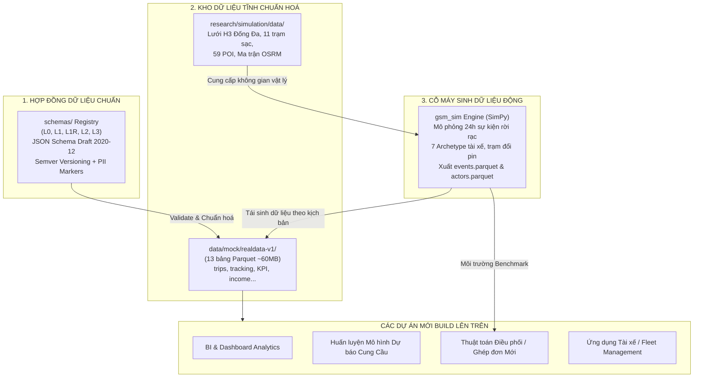
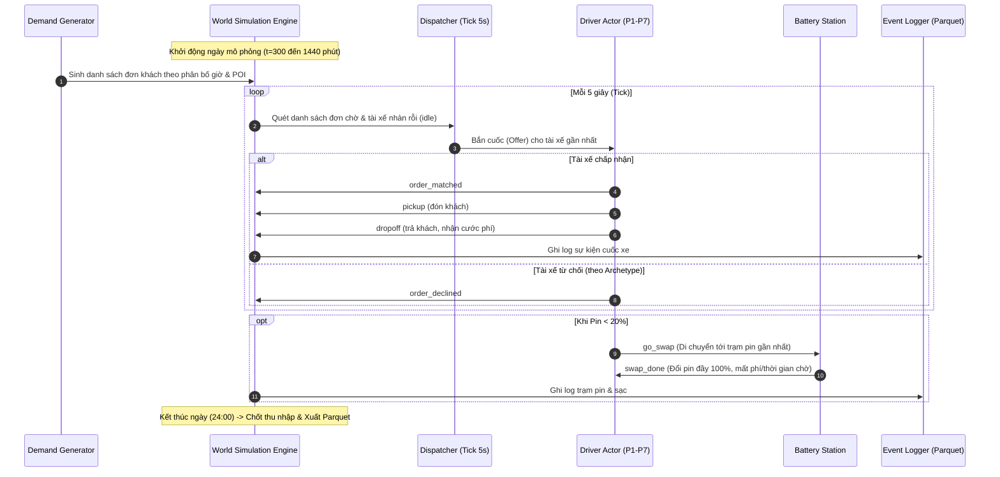

# CẨM NANG KỸ THUẬT: NỀN TẢNG DỮ LIỆU & SIMULATOR MÔ PHỎNG MÔI TRƯỜNG
## (Data Foundation & Environment Simulator Handover Guide)

> **Dành cho**: Các kỹ sư, chuyên viên dữ liệu và các nhóm phát triển tiếp nhận nền tảng dữ liệu hoặc muốn xây dựng các dự án mới (Data Science, Phân tích thị trường, AI/ML, Dispatching engine, Fleet management, App tài xế) trên hệ thống này.  
> **Trọng tâm**: Chuẩn hóa Data Schemas phân tầng (L0–L3), Kho dữ liệu nền tảng 13 bảng Parquet thực tế, Dữ liệu không gian Hex H3 & OSRM, và Engine Simulator sinh dữ liệu động.  
> ⚠️ **Ranh giới bảo mật & sở hữu**: Gói bàn giao này **HOÀN TOÀN KHÔNG CHỨA BỘ GIẢI/SOLVER** (`gsm_core/solvers/*`). Simulator thuần túy đóng vai trò là **Nền tảng Mô phỏng Môi trường & Cấp Phát Dữ Liệu (Synthetic Data Provider)** để các dự án khác khai thác hoặc tự cắm thuật toán riêng vào thử nghiệm.

---

## MỤC LỤC
1. [Tổng quan Kiến trúc & Vai trò Nền tảng](#1-tổng-quan-kiến-trúc--vai-trò-nền-tảng)
2. [Hệ thống Data Schemas Phân tầng (`schemas/` Registry)](#2-hệ-thống-data-schemas-phân-tầng-schemas-registry)
3. [Kho Dữ liệu Nền tảng Sẵn có (Foundational Datasets & Catalog)](#3-kho-dữ-liệu-nền-tảng-sẵn-có-foundational-datasets--catalog)
4. [Simulator Mô phỏng Môi trường & Cấp Dữ liệu Động (`gsm_sim`)](#4-simulator-mô-phỏng-môi-trường--cấp-dữ-liệu-động-gsm_sim)
5. [Công cụ Vận hành Dữ liệu & Hướng dẫn Tích hợp (Runbook)](#5-công-cụ-vận-hành-dữ-liệu--hướng-dẫn-tích-hợp-runbook)
6. [Bộ Test Kiểm chứng Dữ liệu & Tính Toàn vẹn (Verification Suite)](#6-bộ-test-kiểm-chứng-dữ-liệu--tính-toàn-vẹn-verification-suite)

---

## 1. TỔNG QUAN KIẾN TRÚC & VAI TRÒ NỀN TẢNG

### 1.1. Tại sao cần Nền tảng Dữ liệu & Simulator này?
Khi phát triển các giải pháp phần mềm, mô hình AI hoặc thuật toán điều vận cho ngành gọi xe / xe điện (Ride-hailing & EV Fleet), các nhóm phát triển thường gặp 3 trở ngại lớn:
1. **Thiếu dữ liệu thật hoặc vướng rào cản bảo mật (PII/Bảo mật kinh doanh)**: Dữ liệu vận hành thực tế của các hãng taxi/xe máy rất khó trích xuất tự do để chia sẻ giữa các phòng ban hoặc đối tác.
2. **Không có chuẩn hợp đồng dữ liệu (Data Contracts)**: Mỗi dự án thiết kế database một kiểu, dẫn đến sự phân mảnh, không thể tái sử dụng dữ liệu giữa các module.
3. **Không có môi trường thử nghiệm đối kháng (Digital Twin)**: Không thể thử nghiệm thuật toán điều phối mới trực tiếp trên đường phố thực tế vì rủi ro gián đoạn kinh doanh và thất thoát doanh thu.

**Hệ thống bàn giao giải quyết trọn vẹn 3 bài toán trên thông qua mô hình kiềng 3 chân:**



### 1.2. Ranh giới bàn giao (Boundary)
- **CUNG CẤP**:
  * Toàn bộ thư mục `schemas/` với các contract chuẩn hóa.
  * Toàn bộ 13 bảng Parquet thực tế trong `data/mock/realdata-v1/`.
  * Toàn bộ dữ liệu địa lý, POI, trạm pin, OSRM trong `research/simulation/data/`.
  * Cỗ máy mô phỏng môi trường thế giới tài xế `src/gsm_sim/` (chế độ Natural Baseline, `advice.enabled: false`).
  * Bộ công cụ kiểm định dữ liệu và script nạp PostgreSQL / tái sinh mock.
- **KHÔNG CUNG CẤP**:
  * Các bộ giải tối ưu hóa toán học / solver (`gsm_core/solvers/*` như S1–S9: `shift_dp`, `bonus_feasibility`, `idle_reduction`, `capacity_alloc`...). Các bộ giải này thuộc quyền sở hữu riêng của bài toán kinh doanh gốc.

---

## 2. HỆ THỐNG DATA SCHEMAS PHÂN TẦNG (`schemas/` REGISTRY)

Kho hợp đồng dữ liệu nằm tại thư mục gốc `schemas/`, được thiết kế theo tiêu chuẩn **JSON Schema Draft 2020-12** và quản lý chặt chẽ qua công cụ `gsm_core.schema_registry.SchemaRegistry`.

### 2.1. Phân tầng kiến trúc dữ liệu
Hệ thống phân định 6 tầng dữ liệu có trách nhiệm rõ ràng:

| Tầng | Tên gọi | Đặc điểm & Tính chất | Thực thể tiêu biểu |
|---|---|---|---|
| **`l0/`** | **Reference Data** | Dữ liệu danh mục, cấu hình hệ thống, ít biến động (slowly-changing). Phải có version. | `driver_profile`, `policy_bundle`, `station`, `zone`, `service_type` |
| **`l1/`** | **Event Log** | Nhật ký sự kiện thực tế quan sát được (observable-only). **Bất biến (immutable), NGHIÊM CẤM chứa biến ẩn (latent fields)** như mức mệt mỏi hay tâm lý. | `app_event`, `trip_record`, `gps_ping`, `battery_swap`, `wallet_ledger` |
| **`l1r/`** | **Real GSM Tables** | Khế ước schema của 13 bảng dữ liệu GSM thực tế trích xuất từ BigQuery/Data Warehouse. | `driver_statistic_daily`, `driver_income_daily`, `trips`, `driver_hex_tracking` |
| **`l2/`** | **State Fields** | Các trường trạng thái dẫn xuất từ sự kiện L1 theo chu kỳ (derivation jobs). | `driver_day_state`, `supply_demand_field`, `station_state` |
| **`l2i/`** | **Inferred Views** | Dữ liệu suy luận/phỏng đoán. Bắt buộc gắn nhãn `source: INFERRED` và ghi rõ phiên bản quy tắc suy luận (`rule_version`). | `driver_behavior_inferred`, `demand_forecast` |
| **`l3/`** | **Feature Views** | Các bảng đặc trưng tổng hợp được làm sạch, phục vụ trực tiếp cho mô hình Machine Learning hoặc phân tích chuyên sâu. | `driver_features_hourly`, `dispatch_features` |

### 2.2. Các quy chuẩn bất biến trong Schema
Mọi bản ghi dữ liệu khi lưu trữ hoặc trao đổi giữa các service phải tuân thủ:
1. **Định danh nguồn dữ liệu (`source`) bắt buộc**:
   * `REAL`: Dữ liệu thật từ vận hành GSM.
   * `MOCK`: Dữ liệu sinh ra từ simulator hoặc mock generator.
   * `ESTIMATED`: Dữ liệu ước lượng thô.
   * `INFERRED`: Dữ liệu suy luận từ thuật toán logic.
2. **Bảo vệ dữ liệu cá nhân (`x-sensitivity: pii`)**:
   * Các trường như `phone_number`, `full_name`, `sap_profile_id`, tọa độ GPS thô được gắn cờ `x-sensitivity: pii` để các pipeline xử lý dữ liệu tự động hash/ẩn danh trước khi cấp cho môi trường dev.
3. **Cơ chế Đa phiên bản (Semver Multiversioning)**:
   * File mới nhất luôn có tên `{entity}.schema.json`.
   * Các bản ghi lịch sử được lưu dưới dạng `{entity}@{version}.schema.json` (ví dụ: `driver_profile@1.0.0.schema.json`).
   * Khi cần nâng cấp schema: chỉ thêm trường `optional` (minor bump), không tự ý xóa cột nếu chưa qua thời gian deprecate.

---

## 3. KHO DỮ LIỆU NỀN TẢNG SẴN CÓ (FOUNDATIONAL DATASETS & CATALOG)

Dự án cung cấp sẵn một kho dữ liệu tĩnh hoàn chỉnh, đã được chuẩn hóa và kiểm định tính toàn vẹn.

### 3.1. 13 Bảng Dữ liệu Thực tế (`data/mock/realdata-v1/`)
Toàn bộ 13 bảng dữ liệu chuẩn hóa dạng Apache Parquet (tổng dung lượng ~60MB) đặt tại `data/mock/realdata-v1/`:

| Tên File Parquet | Dung lượng | Số dòng mẫu | Ý nghĩa & Ứng dụng cho dự án mới |
|---|---|---|---|
| `trips.parquet` | ~8.0 MB | ~150,000 | Chi tiết từng chuyến đi: giờ đón/trả, tọa độ Hex đón/trả, quãng đường, giá cước, thời gian di chuyển. Rất tốt để train mô hình ETA và giá cước. |
| `public_driver_hex_tracking.parquet` | ~48.2 MB | ~1,200,000 | Vết di chuyển của đội xe theo các ô H3 Hexagon qua từng phút. Ứng dụng xây dựng bản đồ nhiệt (Heatmap), phân tích mật độ cung xe. |
| `driver_statistic_daily.parquet` | ~140 KB | ~3,000 | Thống kê hiệu suất ngày của tài xế: số cuốc nhận, số cuốc hủy, tỷ lệ chấp nhận (acceptance rate), đánh giá sao. Dùng đánh giá chất lượng tài xế. |
| `driver_income_daily.parquet` | ~189 KB | ~3,000 | Báo cáo tài chính ngày: doanh thu gộp (gross fee), hoa hồng công ty (commission), thu nhập thực nhận của tài xế (payout). |
| `driver_orders_rush_hours.parquet` | ~375 KB | ~3,000 | Phân bổ số cuốc và doanh thu giữa **Giờ cao điểm (Rush hour)** và **Giờ thường (Normal hour)**. Phục vụ phân tích hành vi cày cuốc. |
| `driver_online_hours_sap_id.parquet` | ~38 KB | ~1,500 | Tổng thời gian online thực tế, trạm đỗ (depot), loại hợp đồng tài xế. |
| `driver_bike_stoppoints.parquet` | ~22 KB | ~1,200 | Điểm dừng đỗ, thời gian chờ khách của tài xế xe máy. Phục vụ bài toán gợi ý vị trí đón khách tối ưu. |
| `kpi_driver_platform_calculator_gbq.parquet` | ~13 KB | ~500 | Bảng tính thưởng khoán tuần/tháng, theo dõi tiến độ đạt mốc thưởng. |
| `public_mission.parquet` | ~11 KB | ~50 | Danh mục các chương trình nhiệm vụ thưởng theo khung giờ (ví dụ: chạy 5 cuốc trưa thưởng 50.000đ). |
| `public_mission_earn_history.parquet` | ~189 KB | ~2,500 | Lịch sử nhận thưởng nhiệm vụ của tài xế. |
| `public_user_mission_progress.parquet` | ~6 KB | ~300 | Tiến độ thực hiện nhiệm vụ thời gian thực của từng tài xế. |
| `driver_penalization_ATA.parquet` | ~9 KB | ~100 | Lịch sử phạt hành vi / trừ tiền vi phạm quy chế. |
| `public_frauds.parquet` | ~6 KB | ~50 | Cảnh báo gian lận hoặc bất thường di chuyển. |

### 3.2. Data Catalog Chi Tiết (`docs/data-catalog/gsm-data-catalog.csv`)
Dự án có sẵn tài liệu tra cứu từ điển dữ liệu chuẩn hóa tại `docs/data-catalog/gsm-data-catalog.csv` và `gsm-data-catalog.xlsx`. Mỗi bảng đều có thông tin:
- Tên bảng đầy đủ trên BigQuery / PostgreSQL.
- Danh sách trường (`fields_known`).
- Cột PII cần bảo mật (`pii_columns`).
- Usecase nghiệp vụ tương ứng (Hiệu suất, Điểm cần cải thiện, Tiến độ KPI, Giảm thời gian rỗng, Chế tài).

### 3.3. Dữ liệu Không Gian & Hạ Tầng (`research/simulation/data/`)
- **`dd_geom.json`**: Ranh giới đa giác địa lý của quận Đống Đa (Hà Nội).
- **`batt_dd.json` & `battery_nodes.json`**: Tọa độ địa lý của **11 trạm đổi pin xe máy điện GSM** hoạt động trên địa bàn.
- **`poi_dd.json`**: **59 Điểm tập trung nhu cầu (Points of Interest)** gồm 26 bệnh viện lớn, 13 trường đại học, các khu chung cư và trung tâm thương mại.
- **`osrm_matrix_dd.parquet`**: Ma trận khoảng cách thực tế (km) và thời gian chạy xe thực tế (phút) giữa mọi cặp ô Hex H3 trong mạng lưới, tính toán theo bản đồ đường bộ OSRM (Open Source Routing Machine), không phải khoảng cách chim bay.

---

## 4. SIMULATOR MÔ PHỎNG MÔI TRƯỜNG & CẤP DỮ LIỆU ĐỘNG (`gsm_sim`)

Simulator là một cỗ máy mô phỏng thế giới ảo (Digital Twin) theo nguyên lý **Mô phỏng sự kiện rời rạc (Discrete-Event Simulation)** viết bằng Python trên nền tảng **SimPy**.

### 4.1. Kiến trúc hoạt động của Simulator
Simulator tái hiện chân thực một ngày hoạt động (từ 05:00 sáng đến 24:00 đêm = 1440 phút):



### 4.2. 7 Archetype Tài Xế Thực Tế (`archetypes.py`)
Hệ thống không mô phỏng tài xế như những con robot vô cảm giống hệt nhau, mà chia thành **7 nhóm tính cách (Archetypes)** bám sát hành vi thực tế của tài xế công nghệ:

| Mã | Tên Archetype | Tỷ lệ đội xe | Giờ làm việc | Ngưỡng nhận cuốc (`accept_base`) | Đặc điểm hành vi |
|---|---|---|---|---|---|
| **P1** | Full-time Chuẩn | 35% | 07:00 – 19:00 | 92% | Chăm chỉ, ổn định, ưu tiên chạy đủ chỉ tiêu ngày. |
| **P2** | Part-time Sinh viên / Bán thời gian | 20% | 11:00 – 14:00, 17:00 – 21:00 | 85% | Chỉ bật app vào giờ cao điểm hoặc khi rảnh rỗi. |
| **P3** | Top Cày Cuốc (Hardcore) | 15% | 06:00 – 22:00 | 96% | Sẵn sàng chạy xa, cày đêm để săn thưởng khoán tuần. |
| **P4** | Tân Binh (Newbie) | 10% | 08:00 – 18:00 | 78% | Chưa thạo đường, hay từ chối cuốc khó, được hỗ trợ chính sách bù cước. |
| **P5** | Thận Trọng / Giữ Xe | 10% | 07:30 – 17:30 | 88% | Luôn sạc pin sớm khi còn 30%, không thích chạy cố khi mệt. |
| **P6** | Chuyên Ca Sáng Sớm | 5% | 05:00 – 13:00 | 93% | Khai thác khách đi làm sớm, đi chợ, ra bến xe. |
| **P7** | Chuyên Ca Tối / Đêm | 5% | 16:00 – 24:00 | 90% | Chạy tối, đón khách ăn uống, giải trí, chịu được áp lực đêm. |

### 4.3. Đặc tả Dữ liệu Đầu ra được Lưu trữ (`runs/`)
Mỗi lần chạy mô phỏng, hệ thống tự động lưu kết quả vào thư mục `runs/<TIMESTAMP>_seed<N>/` gồm 3 tệp cốt lõi:

#### A. `events.parquet` (Nhật ký Sự kiện Môi trường Chi tiết)
Lưu lại toàn bộ lịch sử diễn biến từng phút của toàn bộ thế giới mô phỏng:
- **`t_min`** (`float`): Thời điểm phút trong ngày (tính từ 00:00). Ví dụ: `420.5` tương ứng với 07 giờ 00 phút 30 giây.
- **`actor_id`** (`int`): Mã định danh tài xế thực hiện sự kiện (`-1` là sự kiện cấp toàn hệ thống).
- **`kind`** (`str`): Loại sự kiện, bao gồm:
  * Sự kiện cuốc xe: `order_matched`, `order_declined`, `order_skipped_soc`, `order_cancelled_after_accept`, `order_expired`, `pickup`, `dropoff`, `trip_rated`.
  * Sự kiện xe & trạm pin: `go_swap`, `swap_done`, `swap_failed`, `battery_stranded`, `charge_home_start`, `charge_home_end`.
  * Sự kiện tài xế: `go_online`, `end_shift`, `rest`, `relocate`, `day_end_settle`, `newbie_guarantee_topup`.
- **`cell`** (`str`): Mã ô H3 Hexagon cấp 9 (độ phân giải ~100m) nơi sự kiện diễn ra.
- **`d_*`** (`dynamic fields`): Các cột chi tiết mở rộng:
  * `d_order_id`: Mã cuốc xe.
  * `d_fare_vnd`: Giá cước khách trả (VND).
  * `d_payout_vnd`: Thu nhập thực tế tài xế nhận (VND).
  * `d_distance_km`: Chiều dài hành trình cuốc xe.
  * `d_duration_min`: Thời gian chạy xe thực tế.
  * `d_soc_pct`: Dung lượng pin tại thời điểm đó (%).
  * `d_station`: Mã trạm đổi pin được chọn.
  * `d_wait_min`: Thời gian tài xế phải xếp hàng chờ đổi pin tại trạm.

#### B. `actors.parquet` (Tổng hợp Hiệu suất Đội xe)
Báo cáo thống kê cuối ngày cho từng tài xế:
- `actor_id`: ID tài xế.
- `archetype`: Nhóm tính cách (P1..P7).
- `trips`: Tổng số cuốc hoàn thành trong ngày.
- `offered`: Số cuốc được điều phối bắn tới.
- `accepted`: Số cuốc tài xế đồng ý nhận.
- `completed`: Số cuốc chở khách thành công tới đích.
- `cancelled`: Số cuốc hủy sau khi đã nhận.
- `gross_vnd`: Tổng doanh số cước thu được (VND).
- `payout_vnd`: Tổng thu nhập thực tế về ví (đã cộng thưởng ngày/tuần và trừ phí đổi pin).
- `acceptance_rate`: Tỷ lệ chấp nhận cuốc (`accepted / offered`).
- `completion_rate`: Tỷ lệ hoàn thành cuốc (`completed / accepted`).
- `online_min`: Số phút tài xế bật app hoạt động.
- `empty_min`: Số phút chạy rỗng hoặc đứng chờ không có khách.
- `stranded`: Số lần hết sạch pin giữa đường phải cứu hộ (mục tiêu luôn bằng 0).
- `soc_end`: Dung lượng pin còn lại cuối ca (%).

#### C. `manifest.json` (Hồ sơ Metadata & Chỉ số Hệ thống)
Chứa thông tin cấu hình phiên chạy, hạt giống ngẫu nhiên (`seed`), định danh tất định (`run_id_deterministic`) và bản tóm tắt các chỉ số vận hành toàn thành phố (`orders_total`, `orders_completed`, `served_rate`, `pickup_eta_median`...).

---

## 5. CÔNG CỤ VẬN HÀNH DỮ LIỆU & HƯỚNG DẪN TÍCH HỢP (RUNBOOK)

### 5.1. Thiết lập môi trường nhanh
Simulator và kho dữ liệu hoàn toàn độc lập, chỉ yêu cầu Python (>= 3.11) và các thư viện tính toán cơ bản:

```bash
# Cài đặt các thư viện lõi cho Data & Simulation
pip install simpy h3 polars pyarrow shapely pyyaml scipy
```

### 5.2. Chạy Simulator sinh dữ liệu theo yêu cầu
Để sinh 1 tập dữ liệu mới (ví dụ với seed 100):

```bash
# Chạy mô phỏng và tự động ghi parquet vào thư mục runs/
python -m gsm_sim.cli run --config configs/pilot_hanoi.yaml --seed 100
```

### 5.3. Code mẫu đọc và khai thác dữ liệu bằng Python Polars
Dưới đây là đoạn mã mẫu chuẩn mà các dự án khác có thể tái sử dụng ngay để đọc và phân tích dữ liệu:

```python
import polars as pl
from pathlib import Path

# 1. Đọc dữ liệu tĩnh 13 bảng GSM (Ví dụ: dữ liệu cuốc xe trips)
trips_df = pl.read_parquet("data/mock/realdata-v1/trips.parquet")
print("=== THỐNG KÊ 13 BẢNG GSM TĨNH ===")
print(f"Tổng số cuốc trong trips.parquet: {len(trips_df):,}")
print(trips_df.select(["order_id", "driver_id", "gross_fare", "distance_km", "pickup_hex"]).head(5))

# 2. Đọc dữ liệu sự kiện do Simulator sinh ra trong runs/
latest_run = sorted(Path("runs").glob("*_seed*"))[-1]
events_df = pl.read_parquet(latest_run / "events.parquet")
actors_df = pl.read_parquet(latest_run / "actors.parquet")

print(f"\n=== DỮ LIỆU SIMULATOR SINH RA ({latest_run.name}) ===")
print(f"Tổng số sự kiện mô phỏng: {len(events_df):,}")
print(f"Tổng số tài xế tham gia: {len(actors_df)}")

# Phân tích thu nhập bình quân theo từng nhóm Archetype tài xế
income_by_archetype = actors_df.group_by("archetype").agg([
    pl.col("trips").median().alias("trips_median"),
    pl.col("payout_vnd").median().alias("payout_median_vnd"),
    pl.col("acceptance_rate").mean().alias("avg_acceptance_rate"),
]).sort("payout_median_vnd", descending=True)

print("\n--- Hiệu suất tài xế theo Archetype ---")
print(income_by_archetype)
```

### 5.4. Hướng dẫn tùy biến cho Địa bàn / Phương tiện mới
Khi muốn áp dụng simulator cho quận khác, thành phố khác hoặc loại xe điện khác:
1. **Đổi bản đồ & Trạm sạc**: Chuẩn bị file tọa độ địa lý GeoJSON cho địa bàn mới, chuyển sang định dạng JSON chứa các ô H3 và vị trí trạm pin trong `configs/<config_moi>.yaml`.
2. **Đổi cự ly đường bộ**: Chạy script trích xuất ma trận OSRM (`scripts/fetch_osrm_matrix.py`) cho vùng đất mới để có ma trận khoảng cách chính xác.
3. **Đổi cấu hình xe điện**: Trong file YAML, điều chỉnh dung lượng pin (`battery_kwh`), mức tiêu hao năng lượng mỗi km (`kwh_per_km`) và thời gian sạc tại trạm để phù hợp với xe ô tô điện (VF 5, VF 8) thay vì xe máy Feliz S.

---

## 6. BỘ TEST KIỂM CHỨNG DỮ LIỆU & TÍNH TOÀN VẸN (VERIFICATION SUITE)

Hệ thống cung cấp một bộ test tự động toàn diện nhằm bảo đảm dữ liệu luôn nhất quán, không xảy ra sai lệch số học hoặc lỗi logic giữa các tầng.

### 6.1. Script Kiểm tra Tức thì (`scripts/smoke_test_data_foundation.py`)
Chỉ cần chạy 1 lệnh duy nhất để kiểm tra toàn bộ sức khỏe nền tảng dữ liệu trong < 30 giây:

```bash
python scripts/smoke_test_data_foundation.py
```
Script sẽ tự động:
- Kiểm tra tính hợp lệ của Schema Registry.
- Kiểm tra sự sẵn sàng của 13 bảng Parquet nền tảng.
- Kiểm tra các file bản đồ H3, POI, trạm pin và OSRM.
- Khởi chạy một phiên mô phỏng mẫu, kiểm tra file sinh ra trong `runs/` và xác thực định luật bảo toàn cuốc xe.

### 6.2. Danh mục các bài Unit Test trọng yếu
Đồng nghiệp có thể chạy các bài test tiêu chuẩn này trước khi đóng gói hoặc tích hợp:

```bash
# 1. Kiểm chứng Data Schemas và tính tương thích ngược
pytest tests/test_schemas.py tests/test_schema_versioning.py -v

# 2. Kiểm chứng tính bảo toàn dữ liệu mô phỏng (sum(driver_trips) == system_trips)
pytest tests/test_sim_metrics.py -v

# 3. Kiểm chứng không gian địa lý H3 và trạm sạc
pytest tests/test_geo.py -v

# 4. Kiểm chứng hành vi và thông số 7 Archetype tài xế
pytest tests/test_actors.py -v
```

### 6.3. Ba Định luật Bảo toàn Dữ liệu Bắt buộc
Mọi phiên bản nâng cấp của Simulator sau này phải luôn vượt qua 3 phép thử bảo toàn:
1. **Bảo toàn số cuốc xe (Trip Conservation)**:
   $$\sum_{a \in \text{Actors}} \text{trips\_completed}(a) = \text{orders\_completed}(\text{System})$$
   Tổng số cuốc xe của tất cả tài xế cộng lại phải bằng chính xác số lượng cuốc xe hoàn thành của hệ thống.
2. **Bảo toàn năng lượng pin (Energy Non-negativity)**:
   Mọi tài xế tại mọi thời điểm phải có $\text{SoC} \ge 0\%$. Nếu xe chạm $0\%$ trên đường mà chưa tới trạm pin, hệ thống bắt buộc kích hoạt sự kiện `battery_stranded` và ghi nhận vào chỉ số cứu hộ.
3. **Không hai nguồn sự thật (Single Source of Truth)**:
   Chỉ số tổng kết (`summarize`) và chỉ số mở rộng (`system_metrics`) phải đọc chung một nguồn sự kiện, tuyệt đối không được tính toán lại bằng công thức khác nhau ở hai nơi.

---
*Tài liệu được biên soạn và chuẩn hóa phục vụ bàn giao độc lập module Nền tảng Dữ liệu & Simulator.*
