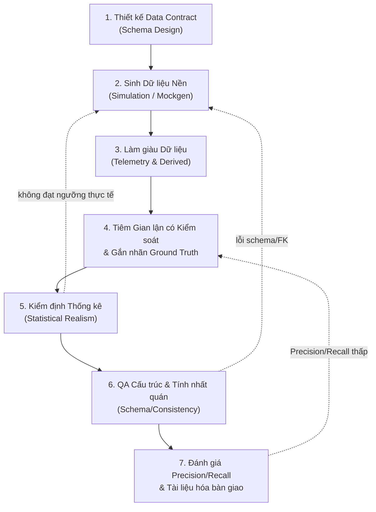

# Quy trình Sinh Dữ liệu Tổng hợp (Synthetic Data Generation)
## Dự án GSM_SIMULATOR × GSM_FRAUD_DETECTION

*2026-09-22*

## 1. Tổng quan & Phạm vi

Tài liệu này chuẩn hóa quy trình **sinh dữ liệu tổng hợp (synthetic data generation)** đang được áp dụng trong hai kho mã nguồn liên kết của dự án: `GSM_SIMULATOR` (sinh dữ liệu nền digital twin cho đội xe taxi điện Hà Nội) và `GSM_FRAUD_DETECTION` / `lcx_core` (làm giàu tín hiệu cảm biến và tiêm hành vi gian lận có kiểm soát để huấn luyện, kiểm thử AI Agent phát hiện gian lận tài xế).

**Loại dữ liệu trong phạm vi tài liệu:** 100% dữ liệu **mô phỏng/tổng hợp (mock)** — không thu thập hay xử lý dữ liệu người dùng thật. Dữ liệu tồn tại dưới hai dạng chính: (1) bảng trạng thái/tổng hợp dạng Parquet (batch, columnar) và (2) log sự kiện thời gian thực dạng JSON/event-stream (telemetry). Vì không có PII thật, rủi ro chính không phải là bảo mật thông tin cá nhân mà là **tính hiện thực thống kê (statistical realism)** và **tính đáng tin của nhãn (label integrity)** — hai yếu tố quyết định liệu mô hình/luật huấn luyện trên dữ liệu này có dùng được cho môi trường thật hay không.

**Mục đích:** cung cấp một quy trình 7 giai đoạn có thể lặp lại, kèm tiêu chí hoàn thành (Definition of Done) rõ ràng cho từng bước, dùng làm tài liệu chuẩn khi báo cáo tiến độ thực tập và khi bàn giao pipeline cho các thành viên khác trong nhóm.

**Phạm vi áp dụng:** sinh mới 13 bảng dữ liệu vận doanh chuẩn L1R, làm giàu tín hiệu telemetry (camera, pin, trạng thái app, giá cước), tiêm gian lận có kiểm soát kèm ground truth, kiểm định thống kê 3 vòng, và đánh giá Precision/Recall cuối cùng.

## 2. Phân loại Dữ liệu Trong Dự án

Dữ liệu tổng hợp được tổ chức theo **4 tầng kiến trúc (L0–L3)**, mỗi tầng ứng với một vai trò khác nhau trong pipeline huấn luyện/đánh giá AI phát hiện gian lận:

| Tầng | Loại dữ liệu | Ví dụ bảng / schema | Vai trò |
| --- | --- | --- | --- |
| **L0 — Reference** | Danh mục/chính sách ít biến động | `driver_profile`, `station`, `zone`, `vehicle_registry` | Nền tham chiếu để kiểm tra khóa ngoại (FK), phát hiện "xe ma" |
| **L1 / L1R — Event Log** | Nhật ký sự kiện gốc, bất biến | 13 bảng Parquet: `trips`, `public_driver_hex_tracking`, `driver_income_daily`... | Dữ liệu nền tảng mô phỏng từ `gsm_sim` / `gsm_core.mockgen`, không bao giờ bị sửa sau khi sinh |
| **L2 / L2i — State & Derived/Telemetry** | Tín hiệu làm giàu, suy diễn | `camera_event`, `charging_session_log`, `fare_breakdown`, `trip_waypoints`, `virtual_online_status` | Bổ sung tín hiệu cảm biến/xử việc còn thiếu ở dữ liệu gốc (camera, pin, giá cước, lộ trình chi tiết) |
| **L2 — Injected Fraud + Ground Truth** | Hành vi gian lận tiêm có kiểm soát, nhãn tách riêng | `fraud_injector/injector.py`, bảng `ground_truth` (`source = "INJECTED_FRAUD"`) | "Bảng đáp án" độc lập để đo Precision/Recall của luật/model phát hiện |
| **L3 — Feature Views** | Đặc trưng đã tổng hợp cho ML | `driver_profile_enriched.parquet`, các bảng feature từ `build_label_store.py` | Đầu vào trực tiếp cho huấn luyện mô hình AI / truy vấn của AI Agent |

**Hai trục bổ sung cần phân biệt rõ khi làm việc:**
1. **Dữ liệu batch (Parquet)** — sinh theo chu kỳ ngày/tháng, dùng cho phân tích thống kê và huấn luyện offline.
2. **Dữ liệu sự kiện thời gian thực (event-stream JSON)** — từ `lcx_core/telemetry_mock/` và `event_sim/`, mô phỏng luồng dữ liệu FastAPI để kiểm thử hệ thống như môi trường sản xuất thật.

Mọi trường dữ liệu đều phải tuân theo **hợp đồng schema** trong `schemas/` (JSON Schema Draft 2020-12, có versioning theo Semver và cờ PII) — đây là điều kiện tiên quyết trước khi sinh bất kỳ loại dữ liệu nào (xem Giai đoạn 1).

## 3. Sơ đồ Quy trình Tổng thể (7 Giai đoạn)



Đây là quy trình **lặp (iterative)**, không phải một chiều: nếu Giai đoạn 5 (kiểm định thống kê) hoặc Giai đoạn 6 (QA cấu trúc) thất bại, phải quay lại Giai đoạn 2 để sinh lại với tham số/seed điều chỉnh — không được sửa tay trực tiếp trên file Parquet đã sinh (vi phạm nguyên tắc Bất biến ở Mục 5). Nếu Giai đoạn 7 cho kết quả Precision/Recall thấp, quay lại Giai đoạn 4 để xem lại mức độ (Light/Medium/Heavy) hoặc định nghĩa mẫu hình gian lận, không phải "sửa luật cho đến khi đạt số" (tránh overfit luật vào đúng bộ dữ liệu đã sinh).

## 4. Chi tiết Từng Giai đoạn & Tiêu chí Hoàn thành (DoD)

### Giai đoạn 1 — Thiết kế Data Contract (Schema)
**Hướng dẫn:** Trong `schemas/`, mọi bảng/sự kiện mới phải có JSON Schema Draft 2020-12 trước khi viết bất kỳ dòng code sinh dữ liệu nào (vd. `camera_event.schema.json`, `charging_session_log.schema.json`).

**Tiêu chí hoàn thành:**
- [ ] Schema có versioning theo Semver (`@1.0.0`) và khai báo tầng (L0/L1/L2/L3)
- [ ] Đánh dấu rõ cờ PII cho từng trường (dù là dữ liệu giả)
- [ ] Khóa chính/khóa ngoại (FK) tới các bảng L0/L1 hiện có được khai báo tường minh
- [ ] Schema được review với mentor/team trước khi khởi động sinh dữ liệu hàng loạt

---

### Giai đoạn 2 — Sinh Dữ liệu Nền (Simulation / Mockgen)
**Công cụ:** `gsm_core.mockgen.realdata` (13 bảng L1R chuẩn BigQuery) hoặc `gsm_sim.cli` (log sự kiện SimPy chi tiết từng phút).
```bash
python -m gsm_core.mockgen.realdata --days 30 --seed-base 7000 \
  --out data/mock/realdata-v2 --start-date 2026-07-01 --continuous
```

**Tiêu chí hoàn thành:**
- [ ] Seed cơ sở (`--seed-base`) được ghi lại để đảm bảo tính tất định (deterministic reproducibility)
- [ ] Đủ chu kỳ tối thiểu để bộc lộ quy luật tuần/tháng (khuyến nghị ≥30 ngày liên tục = 4 chu kỳ tuần)
- [ ] Cờ `--continuous` bật khi cần trạng thái tài xế nối tiếp qua ngày (pin, tiến độ khoán tuần)
- [ ] Đủ 13 bảng Parquet được sinh đồng bộ, không bảng nào rỗng bất thường
- [ ] Smoke test đầu tiên pass (`python scripts/smoke_test_data_foundation.py`, < 30s)

---

### Giai đoạn 3 — Làm giàu Dữ liệu (Telemetry & Derived)
**Công cụ:** các module trong `lcx_core/telemetry_tier/` và `lcx_core/derived_data/` (camera, pin, trạng thái online, waypoints, phân rã giá cước).

**Tiêu chí hoàn thành:**
- [ ] Dữ liệu làm giàu được ghi ra bảng/file **riêng biệt** (`data/derived/`), không ghi đè lên 13 bảng gốc
- [ ] Mỗi tín hiệu mới neo vào **quy luật vật lý/nghiệp vụ thật** (vd. tốc độ sạc pin 0.25–0.65%/giây, không được bịa số tùy ý)
- [ ] Các cột suy luận/thêm mới được đánh dấu rõ `synthetic_fields` để phân biệt với dữ liệu gốc
- [ ] Có ít nhất 1 test đối chiếu (vd. so sánh lộ trình 2 điểm mút vs. waypoints chi tiết) để chứng minh tín hiệu mới có giá trị bổ sung thực sự

---

### Giai đoạn 4 — Tiêm Gian lận có Kiểm soát & Gắn nhãn Ground Truth
**Công cụ:** `lcx_core/fraud_injector/injector.py`. Đọc dữ liệu gốc lên RAM (không sửa file trên đĩa), tạo thêm các hành vi gian lận ở 3 mức độ: **Nhẹ / Vừa / Nặng**.

**Tiêu chí hoàn thành:**
- [ ] Mọi dòng tiêm có nhãn `source = "INJECTED_FRAUD"` và được lưu vào **bảng đáp án riêng** (`ground_truth`), tách biệt hoàn toàn với luồng dữ liệu chạy qua detector
- [ ] Nguyên tắc "Không lộ đề": detector không được truy cập bảng ground truth trong lúc chạy
- [ ] Cả 3 mức độ (Light/Medium/Heavy) đều có đủ số mẫu tối thiểu để đo được Precision/Recall có ý nghĩa thống kê (khuyến nghị ≥40 mẫu/mức độ, xem `run_injector_eval.py --n-per-severity`)
- [ ] File Parquet gốc trên đĩa **không bị sửa một byte nào** sau bước tiêm (kiểm tra checksum/hash trước-sau)

---

### Giai đoạn 5 — Kiểm định Thống kê (Statistical Realism)
**Công cụ:** `gsm_core.mockgen.generate` + `gsm_core.mockgen.verify_stats`, xuất 3 báo cáo vào `research/experiments/mockgen/`.

**Tiêu chí hoàn thành:**
- [ ] `ROUND-1-schema-report.md`: 100% bảng đạt hợp đồng schema, không lỗi khóa ngoại (FK)
- [ ] `ROUND-2-realism-report.md`: các phân phối then chốt (số cuốc/ngày, thu nhập tài xế Full-time, cự ly chuyến đi) nằm trong ngưỡng benchmark GSM thật/khảo sát thực tế
- [ ] `ROUND-3-consistency-report.md`: không có mâu thuẫn chéo giữa GPS – sổ cái payout – bảng cuốc xe
- [ ] Nếu bất kỳ vòng nào fail → quay lại Giai đoạn 2, không được bỏ qua hoặc sửa thủ công báo cáo

---

### Giai đoạn 6 — QA Cấu trúc & Tính nhất quán
**Công cụ:** `scripts/smoke_test_data_foundation.py`, `scripts/check_parquet_columns.py`, bộ `pytest` (`tests/test_schemas.py`, `test_geo.py`, `test_actors.py`, `test_sim_metrics.py`).

**Tiêu chí hoàn thành:**
- [ ] Toàn bộ unit/regression test pass (`pytest -q` — hiện tại dự án có 71 test)
- [ ] Số cột và kiểu dữ liệu của 13 bảng khớp với `docs/data-catalog/gsm-data-catalog.csv`
- [ ] Dashboard Streamlit mở được và hiển thị đúng heatmap/timeline (kiểm tra trực quan cuối cùng)

---

### Giai đoạn 7 — Đánh giá Precision/Recall & Tài liệu hóa bàn giao
**Công cụ:** `scripts/run_injector_eval.py`, `scripts/run_telemetry_tier_eval.py`, `scripts/run_surge_collusion_eval.py`, `scripts/run_waypoint_accuracy_check.py`.

**Tiêu chí hoàn thành:**
- [ ] Mỗi mẫu hình gian lận có con số Precision/Recall định lượng rõ ràng theo từng mức độ (Light/Medium/Heavy)
- [ ] Kết quả được ghi vào `docs/injector-eval-results.md` (hoặc file tương đương) kèm ngày chạy và seed sử dụng
- [ ] Các hiện tượng bất thường phát hiện được (vd. "self-masking" Z-score) được ghi chú lại làm bài học cho vòng lặp sau
- [ ] Bàn giao kèm: script tái lập (seed + tham số), báo cáo 3 vòng thống kê, kết quả eval — không bàn giao "chỉ file dữ liệu" mà thiếu bằng chứng kiểm chứng

## 5. Nguyên tắc Bảo chứng Chất lượng Dữ liệu

Dữ liệu tổng hợp chỉ được coi là đáng tin cậy khi tuân thủ đủ **4 nguyên tắc** sau ở mọi giai đoạn:

1. **Neo vào phân phối thực tế & quy luật vật lý thật.** Không bịa tham số: tốc độ sạc pin phải nằm trong 0.25–0.65%/giây (giới hạn vật lý thật của xe điện), thời gian ngắt GPS phải neo vào percentile p99 thực tế (~20 giờ) thay vì một con số giả định.
2. **Kiểm thử theo 3 cấp độ tăng dần (Light → Medium → Heavy).** Mức Nhẹ nằm sát ngưỡng bình thường để đo độ nhạy của luật (khả năng bị lách), mức Nặng dùng để xác nhận luật bắt được ở ngưỡng rõ ràng (thường 90–100%).
3. **Bất biến & Truy vết được (Immutability & Traceability).** 13 file Parquet gốc không bị sửa một byte nào sau khi sinh; mọi dòng tiêm/làm giàu phải mang nhãn nguồn gốc rõ ràng (`source`, `synthetic_fields`) để có thể tách ngược ra khỏi dữ liệu thật bất kỳ lúc nào.
4. **Không lộ đề (No leakage).** Bảng đáp án (`ground_truth`) được lưu riêng, hoàn toàn tách biệt với luồng dữ liệu mà detector/model đọc vào — đảm bảo con số Precision/Recall đo được là khách quan, không bị "hack" do model biết trước đáp án.

> Đây không phải thủ tục hình thức — vi phạm nguyên tắc (1) khiến model học được pattern không tồn tại ngoài đời thật; vi phạm (4) khiến con số Precision/Recall báo cáo là vô nghĩa (overfit trên đáp án đã biết).

## 6. Ma trận Công cụ & Lệnh Tham chiếu Nhanh

| Mục đích | Lệnh / Đường dẫn | Giai đoạn |
| --- | --- | --- |
| Cài môi trường | `pip install simpy h3 polars pyarrow shapely pyyaml scipy jsonschema` | Chuẩn bị |
| Smoke test toàn diện (<30s) | `python scripts/smoke_test_data_foundation.py` | 2, 6 |
| Sinh 30 ngày dữ liệu L1R (13 bảng) | `python -m gsm_core.mockgen.realdata --days 30 --seed-base 7000 --out data/mock/realdata-v2 --start-date 2026-07-01 --continuous` | 2 |
| Chạy mô phỏng SimPy theo seed | `python -m gsm_sim.cli run --config configs/pilot_hanoi.yaml --seed 100` | 2 |
| Sinh dữ liệu L1 + kiểm định thống kê | `python -m gsm_core.mockgen.generate ...` rồi `python -m gsm_core.mockgen.verify_stats` | 5 |
| Kiểm tra cấu trúc cột Parquet | `python scripts/check_parquet_columns.py` | 6 |
| Bộ unit/regression test | `pytest tests/test_schemas.py tests/test_geo.py tests/test_actors.py tests/test_sim_metrics.py -v` | 6 |
| Test module phát hiện gian lận | `pytest tests/fraud_detection/ -v` | 6 |
| Đánh giá Precision/Recall 7 mẫu hình Tier A | `python scripts/run_injector_eval.py --n-per-severity 40` | 7 |
| Đánh giá mẫu telemetry mới (camera, pin, xe ma, online ảo) | `python scripts/run_telemetry_tier_eval.py` | 7 |
| Đánh giá mẫu thổi giá Surge | `python scripts/run_surge_collusion_eval.py` | 7 |
| Kiểm tra độ chính xác waypoints | `python scripts/run_waypoint_accuracy_check.py` | 3, 7 |
| Dashboard trực quan hóa | `streamlit run src/gsm_sim/dashboard.py` | 6 |

**Vị trí thư mục chính:** `schemas/` (hợp đồng dữ liệu) · `data/mock/realdata-v2/` (13 bảng gốc) · `src/gsm_core/mockgen/` (engine sinh dữ liệu nền) · `src/lcx_core/fraud_injector/`, `telemetry_tier/`, `derived_data/`, `derived_tier/` (làm giàu + tiêm gian lận) · `research/experiments/mockgen/` (báo cáo kiểm định 3 vòng) · `docs/injector-eval-results.md` (kết quả Precision/Recall).

## 7. Rủi ro Thường gặp & Cách Phòng tránh

| Rủi ro | Biểu hiện | Cách phòng tránh |
| --- | --- | --- |
| **Lộ đề (label leakage)** | Detector vô tình đọc được cột `ground_truth`/`source` trong lúc chạy | Tách vật lý bảng đáp án ra file/schema riêng; review code path của detector trước mỗi lần eval |
| **Tự che mắt thống kê (self-masking)** | Tiêm quá nhiều mẫu gian lận khiến độ lệch chuẩn Z-score của toàn hệ thống bị phình to, làm mờ chính hành vi đã tiêm | Giới hạn tỷ lệ mẫu tiêm/tổng thể; dùng thống kê bền vững (median/MAD) thay vì mean/std khi tỷ lệ tiêm cao |
| **Overfit luật vào dữ liệu đã sinh** | Precision/Recall 100% trên bộ test tự sinh nhưng không tổng quát hóa được | Luôn thử lại trên seed khác chưa dùng khi tinh chỉnh luật; không chỉnh ngưỡng cho đến khi đạt đúng số trên 1 bộ duy nhất |
| **Trôi schema (schema drift)** | Thêm cột/đổi kiểu dữ liệu mà không cập nhật `schemas/` và catalog | Chạy `check_parquet_columns.py` sau mỗi lần sinh; bắt buộc cập nhật schema trước khi đổi code sinh dữ liệu |
| **Không tái lập được (non-determinism)** | Chạy lại cùng lệnh ra kết quả khác | Luôn ghi lại `--seed-base` và tham số config đầy đủ kèm mỗi lần chạy (vd. trong tên thư mục `runs/<timestamp>_seed<N>/`) |
| **Chi phí tái tính tài nguyên lớn** | Mở rộng bản đồ toàn Hà Nội / trạm sạc mới đòi tính lại toàn bộ ma trận khoảng cách OSRM | Đánh giá trước chi phí tính toán, giới hạn phạm vi thay đổi địa lý trong 1 lần lặp (đã thống nhất ngoài phạm vi hiện tại của dự án) |
| **Sinh dữ liệu thiếu review con người** | Sinh hàng loạt rồi mới phát hiện lỗi logic sau nhiều giờ chạy | Chạy thử 1 ngày/1 seed nhỏ để sanity-check trước khi chạy đầy 30 ngày hoặc batch lớn |

## 8. Checklist Bàn giao Cuối cùng

Dùng checklist này trước khi nộp báo cáo thực tập hoặc bàn giao pipeline cho team:

- [ ] Schema liên quan đã được review và versioning (Semver)
- [ ] Lệnh sinh dữ liệu được chạy với seed cố định, ghi lại đầy đủ tham số (tái lập được)
- [ ] Dữ liệu gốc (13 bảng L1R) không bị ghi đè/sửa tay
- [ ] Dữ liệu làm giàu/tiêm gian lận có nhãn nguồn gốc rõ ràng, tách bảng đáp án riêng
- [ ] Smoke test + bộ pytest đầy đủ pass (không skip test lỗi)
- [ ] 3 báo cáo kiểm định thống kê (Schema/Realism/Consistency) đạt chuẩn
- [ ] Kết quả Precision/Recall được ghi nhận định lượng, kèm giải thích cho từng con số bất thường
- [ ] Dashboard/trực quan hóa được kiểm tra thủ công ít nhất 1 lần
- [ ] Tài liệu kỹ thuật (README/handoff doc liên quan) được cập nhật đồng bộ với thay đổi
- [ ] Mentor/reviewer đã xác nhận kết quả trước khi coi là "done"

---

*Tài liệu này nên được cập nhật mỗi khi quy trình thực tế thay đổi (thêm hạng mục làm giàu mới, đổi công cụ kiểm định...) để luôn là nguồn tham chiếu đúng với trạng thái thật của repo.*
